# 🐳 Docker Fundamentals — Deep Dive

---

## 1. What is Docker?

Docker is an open-source platform that enables developers to:

- Build applications  
- Package dependencies  
- Deploy consistently  
- Run applications in isolated environments (containers)  

👉 Docker ensures **“Build once, run anywhere”**
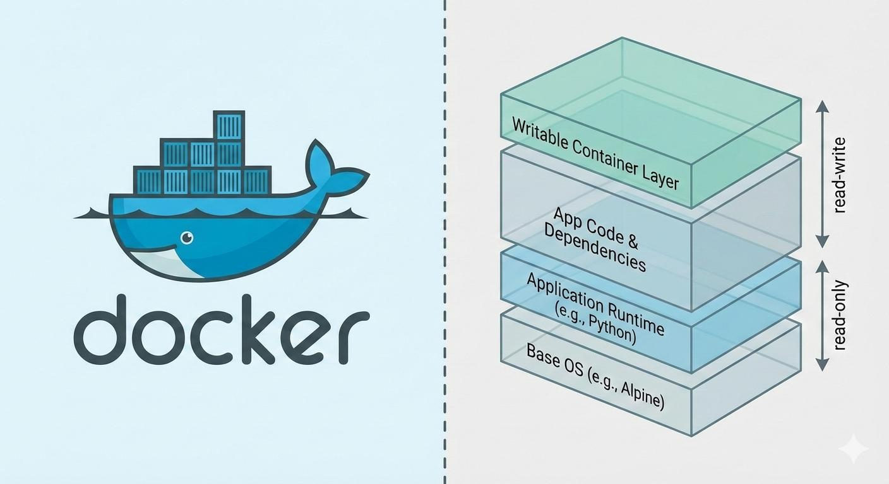
---

## 🔄 Traditional vs Docker

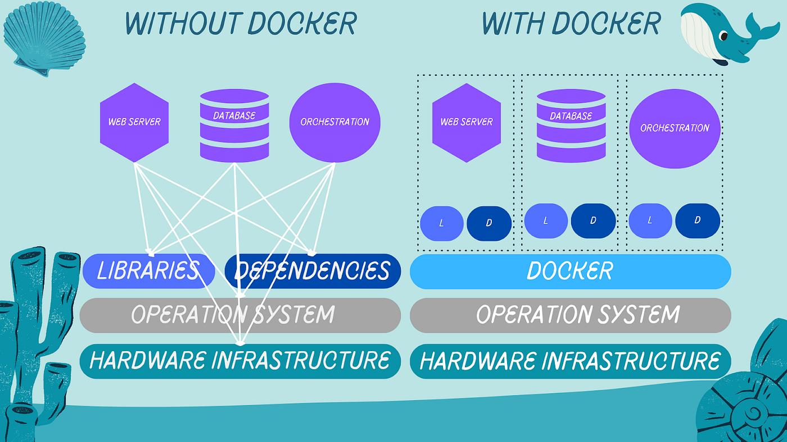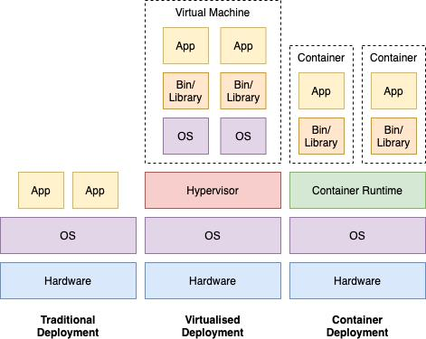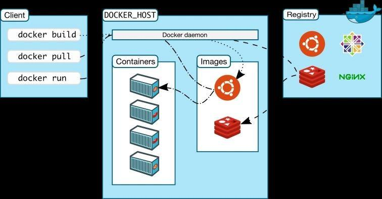

### 🔍 Explanation

### ❌ Without Docker
- Apps depend on system libraries
- Conflicts between applications
- Works on dev machine but fails in production

### ✅ With Docker
- App + dependencies packaged together
- Runs consistently everywhere
- No environment mismatch

---

## 2. What is a Container?

A container is a **lightweight, isolated runtime environment**.

### 📦 Think of it like:

A portable box containing:

- Application code  
- Libraries  
- Environment variables  
- System tools  
- Config files  

👉 It runs the same across:
- Local machine  
- Testing server  
- Production  
- Cloud  

---

## 🧠 Deep Understanding

Containers:
- Share the **host OS kernel**
- Do NOT include full OS
- Use:
  - **Namespaces → Isolation**
  - **Cgroups → Resource control**

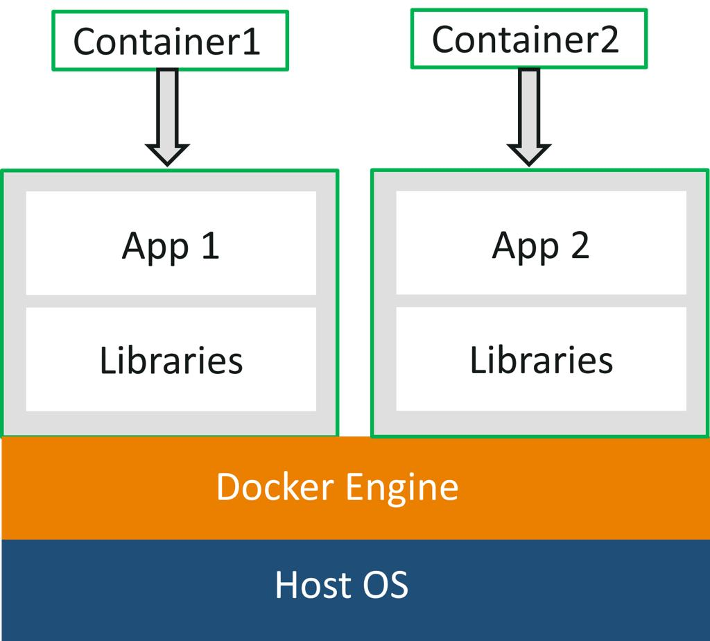 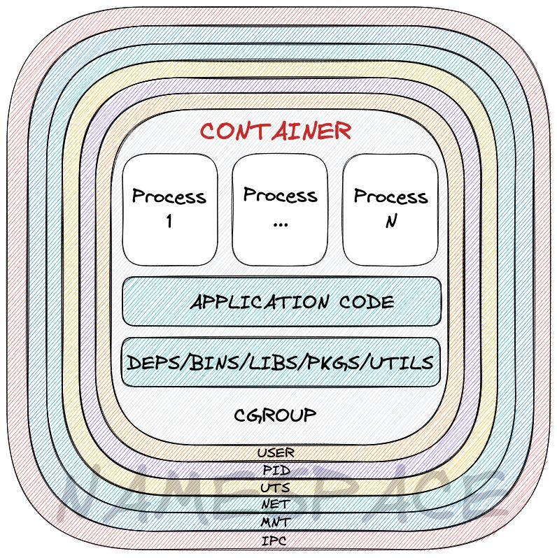 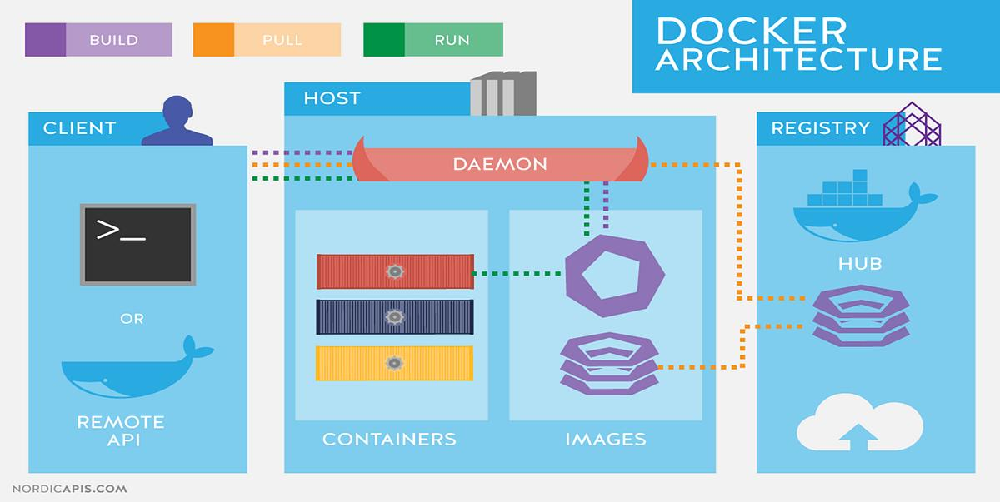 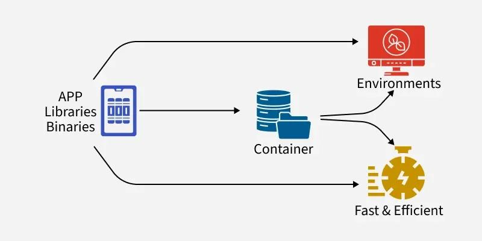
---

## 3. Why we use Docker

### 🚀 Key Benefits

### 🔹 Portability
Run anywhere:
- Local
- Testing
- Production
- Cloud

---

### 🔹 Fast Startup
- Starts in seconds  
- No OS boot required  

---

### 🔹 Lightweight
- No full OS  
- Shares kernel  
- Uses less CPU & memory  

---

### 🔹 Dependency Management
- Everything packaged together  
- No “it works on my machine” problem  

---

### 🔹 DevOps Friendly
- Works with CI/CD tools:
  - Jenkins  
  - GitLab  
  - GitHub Actions  

---

## 4. Virtualization vs Containerization

| Feature | Virtual Machine | Container |
|--------|---------------|----------|
| OS | Full OS per VM | Shared OS |
| Size | Large (GBs) | Small (MBs) |
| Boot Time | Minutes | Seconds |
| Performance | Slower | Near-native |
| Isolation | Strong | Lightweight |

---

## 🧠 Deep Explanation

### Virtual Machine:
- Uses Hypervisor
- Each VM has its own OS
- Heavy and slow

### Container:
- Runs on host OS
- Only includes required libraries
- Fast and efficient

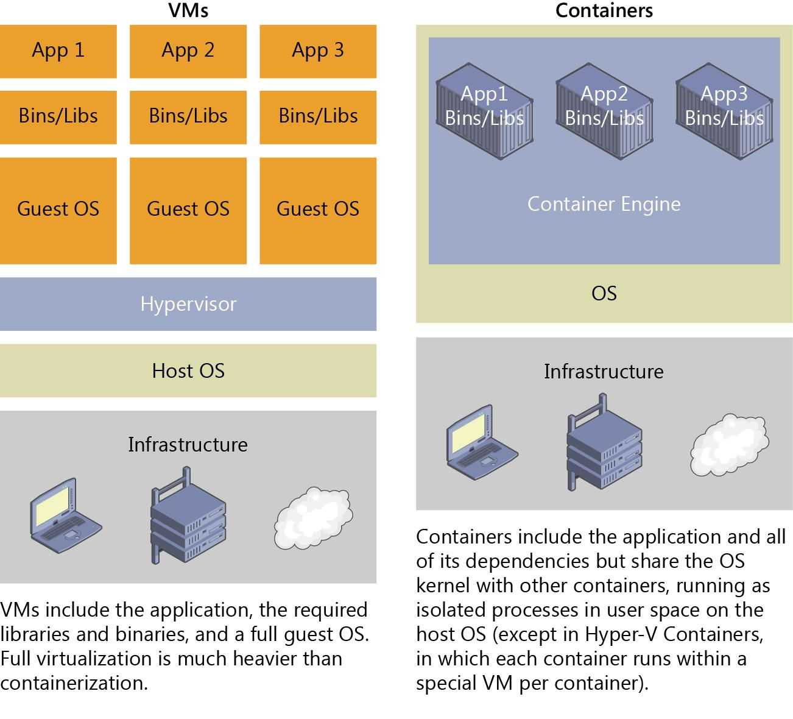
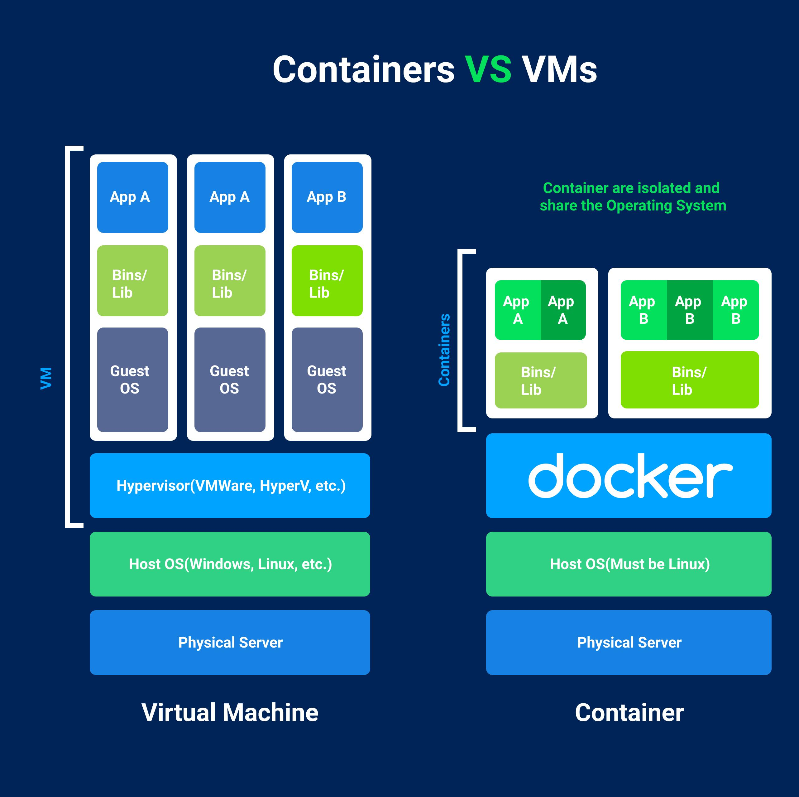

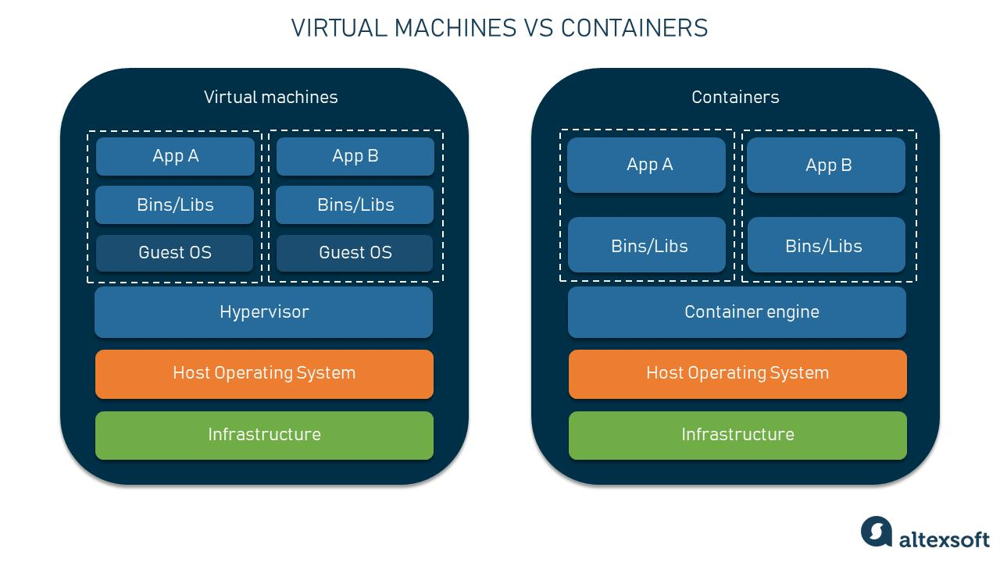

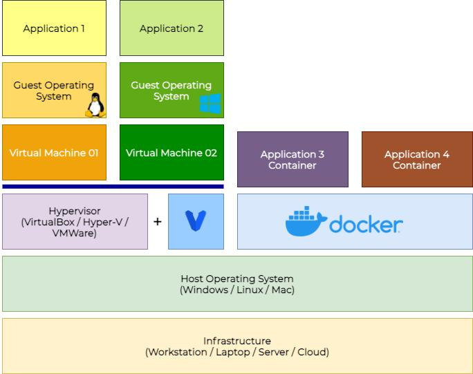

---

## 5. Hypervisors

### Type 1 (Bare Metal)
- Runs directly on hardware
- Examples:
  - VMware ESXi
  - Hyper-V

### Type 2 (Hosted)
- Runs on top of OS
- Examples:
  - VirtualBox
  - VMware Workstation

---

## 6. Limitations of Virtual Machines

- Slow provisioning  
- High resource usage  
- OS overhead  
- Less scalable  

👉 Containers solve these problems

---

## 7. What is a Container (Deep)

A container is:

- Isolated environment  
- Uses OS-level virtualization  
- Built using:
  - Namespaces  
  - Cgroups  

👉 It virtualizes OS, not hardware

---

## 8. Container Tools

- Docker  
- Podman  
- Containerd  
- CRI-O  
- LXC/LXD  
- Rancher  

---

## 9. Docker Overview

- Released in 2013 by Docker Inc.
- Based on DevOps principles:
  - Build
  - Test
  - Deploy fast

---

## 10. Docker Platform Components

- Docker Engine  
- Docker Desktop  
- Docker Compose  
- Docker Swarm  

---

## 11. Docker Engine

Core runtime that:
- Builds images  
- Runs containers  
- Manages lifecycle  

---

## Editions

- Community Edition (Free)  
- Enterprise Edition (Paid)  

---

## 12. Docker Architecture

### Components:

### 🔹 Docker Client
- CLI (`docker run`, `docker build`)
- Talks to daemon via API

---

### 🔹 Docker Daemon
- Core engine
- Builds images
- Runs containers

---

### 🔹 Docker Host
- Machine running Docker

---

### 🔹 Docker Registry
- Stores images
- Example: Docker Hub
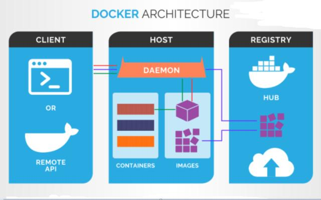
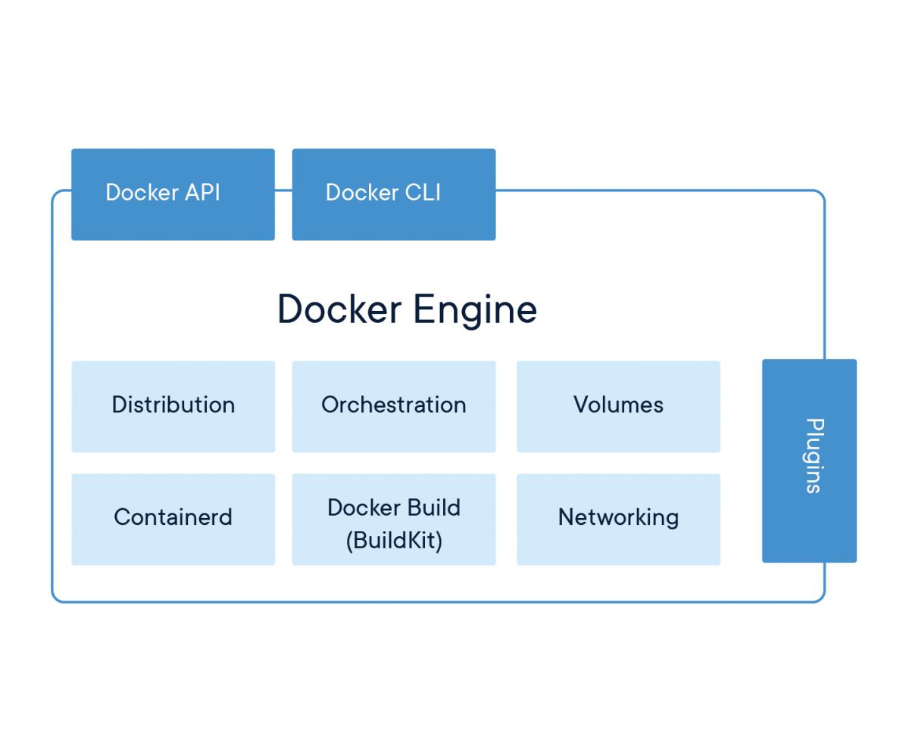
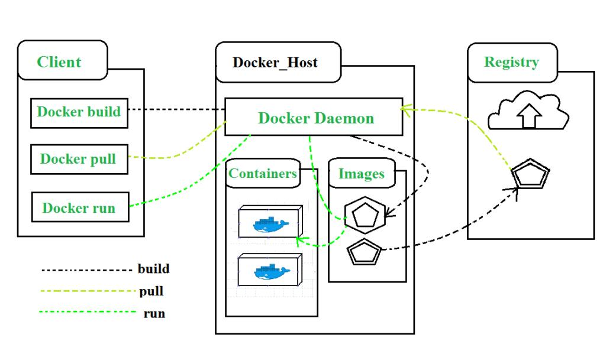
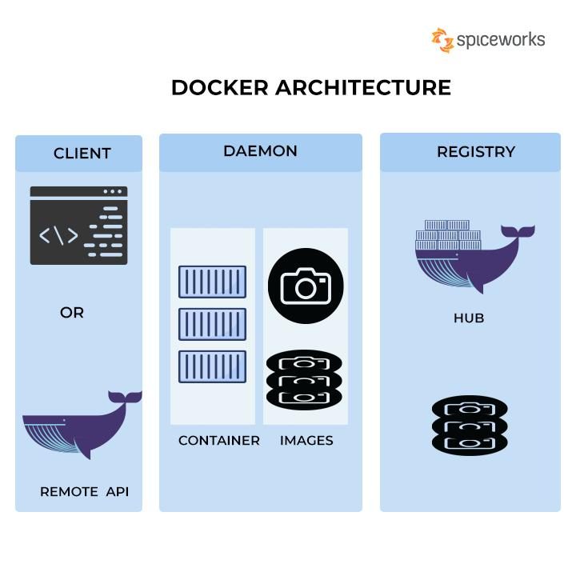
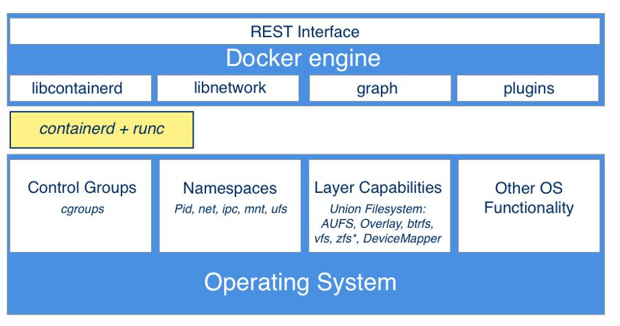
---

## 13. Docker Components

- **Images** → blueprint  
- **Containers** → running instance  
- **Volumes** → persistent storage  
- **Networks** → communication  

---

## Network Types

- Bridge  
- Host  
- Overlay  
- None  
- Macvlan  

---

## 14. Docker Workflow

### Steps:

1. Build → create image  
2. Push → upload to registry  
3. Pull → download image  
4. Run → start container  
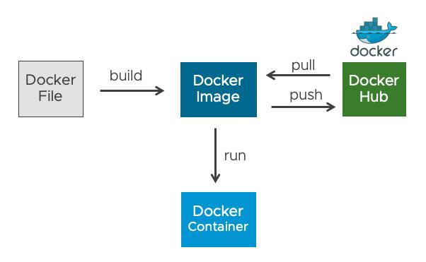
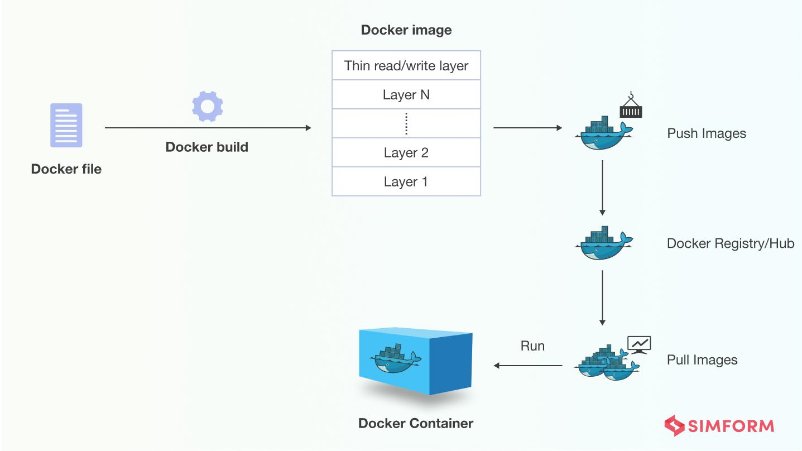
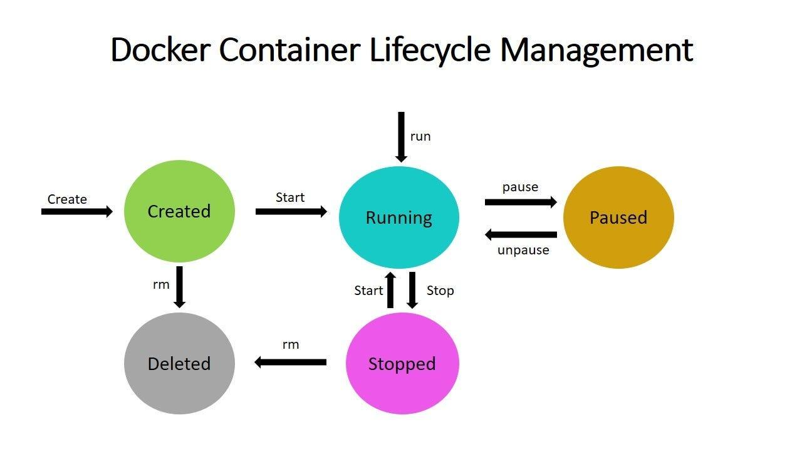
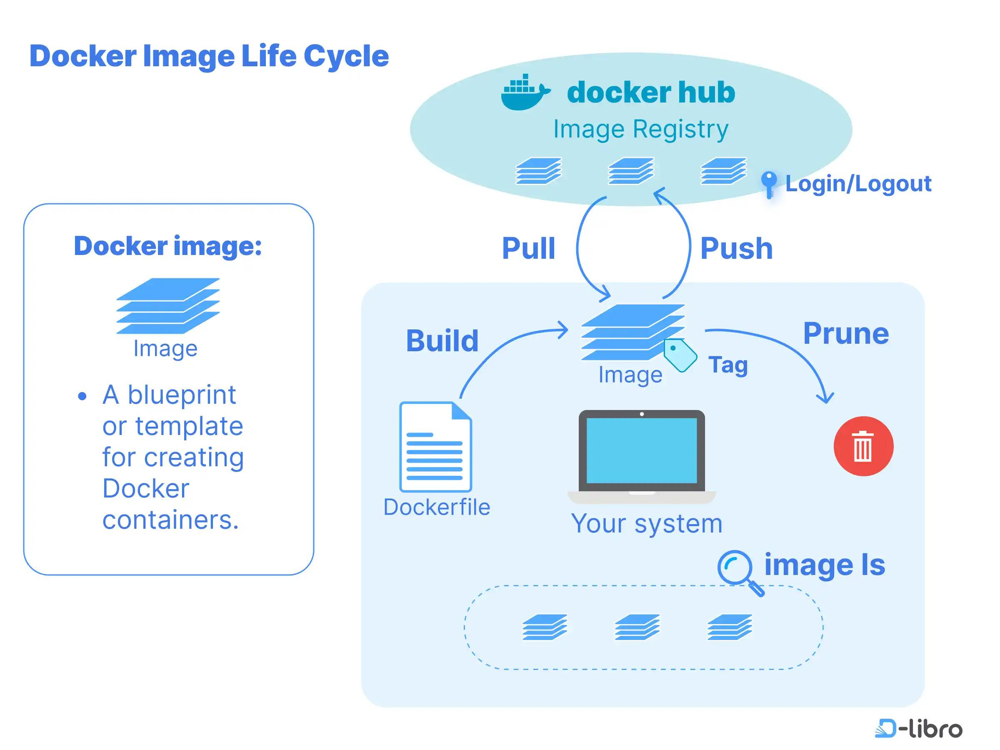
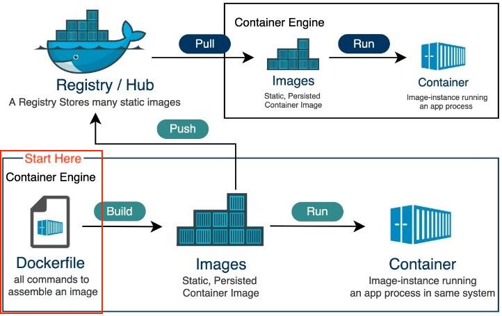
---

## 🎯 Summary

Docker enables:
- Consistent environments  
- Faster deployments  
- Scalable systems  
- Microservices architecture  

---

## 🚀 Real-World Insight

Docker is the **foundation for Kubernetes**.

👉 Without understanding Docker deeply, Kubernetes will feel confusing.
				
				
				
				
				
				
				
				
				
				
				
				
				
				
				
				
				
				
				
				
				
				

