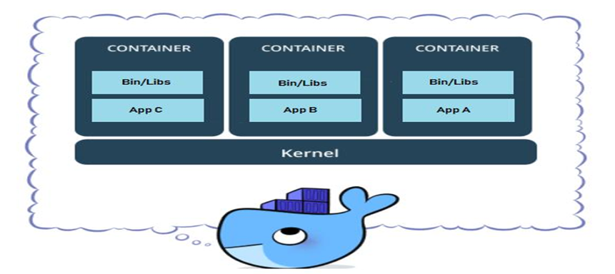
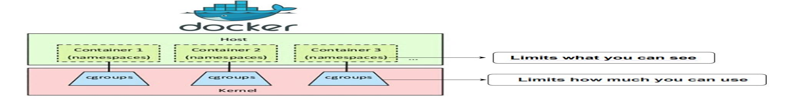
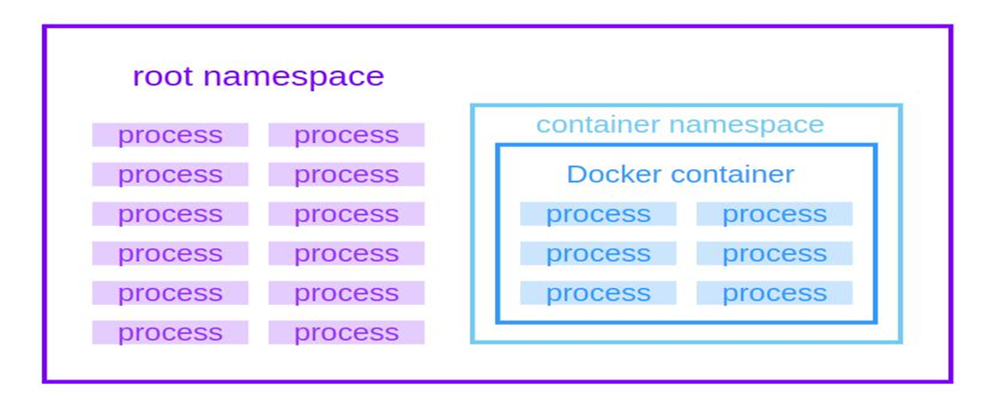
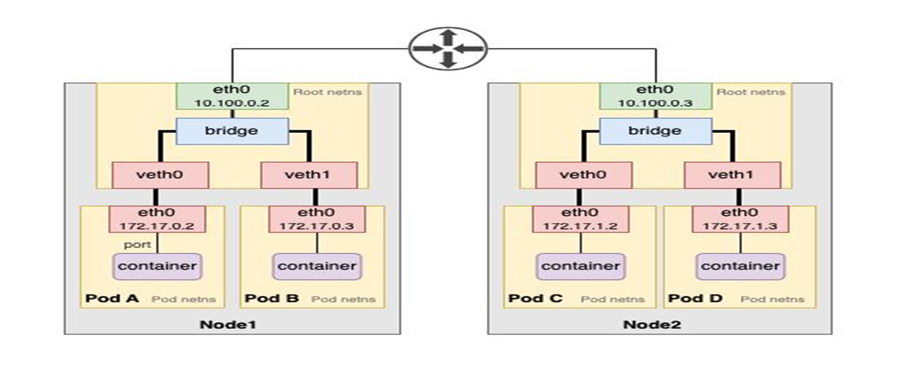
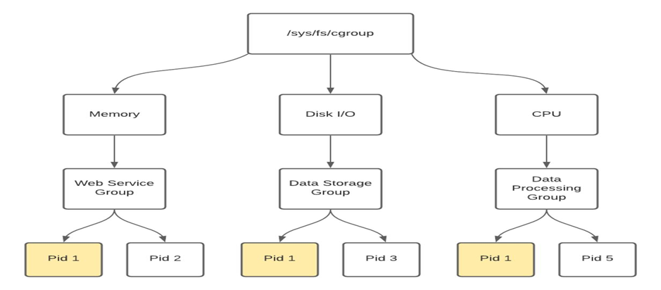
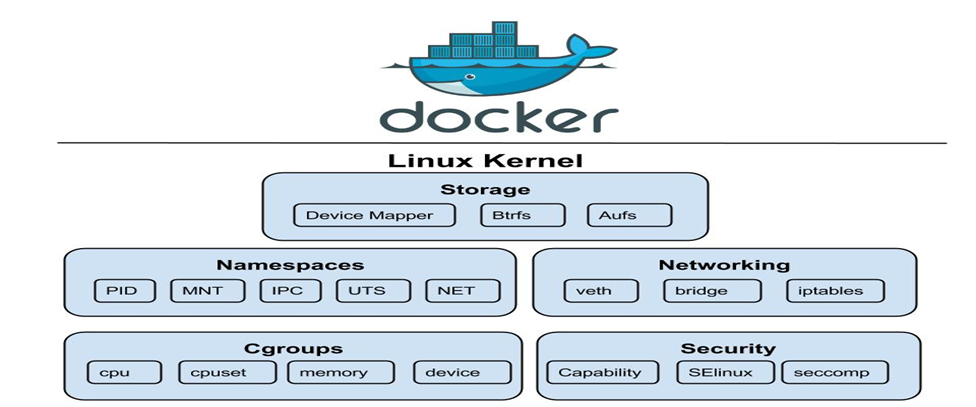
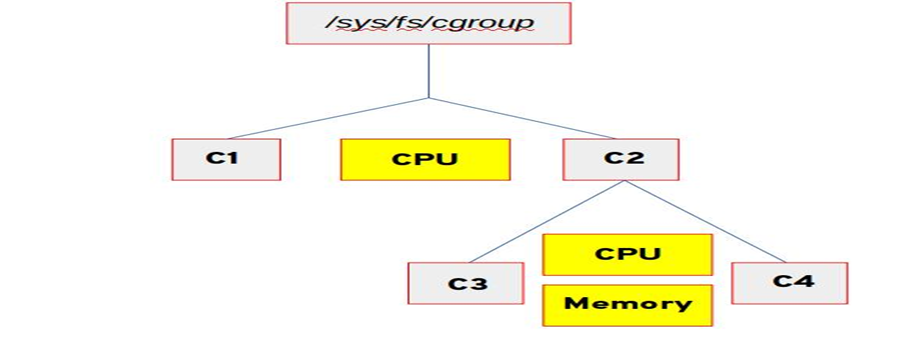

1.     Containers= OS Level Virtualization
"Containers= Containers Only have Libraries and Dependicies x
Binaries which are required for os and application to run."

Basic Architecture:
** Container= process+isolation+limits
2.    What is namespaces?
Namespace= “What you can see” isolation
Namespace is a kernel feature that isolates global system resources.
3.     How kernel stores namespaces?
Every Process has :
task_struct
└── nsproxy
├── pid_ns
├── net_ns
├── mnt_ns
├── uts_ns
├── ipc_ns
└── user_ns
Meaning : each process point to namespaces set

3.     All Namespace types:
1.     PID Namespace: Process isolation
Separate process tree create
Ex: inside container
ps aux=command
Output: PID 1-your app
** Container= process+isolation+limits

4.     What is namespaces?
Namespace is a kernel feature that isolates global system resources.
Namespace= “What you can see” isolation
1.     Net Namespace: Network isolation
Each container las :own IP, own routing table, own port
Ex: ip netns , ip a

2.     Mount namespace: filesystem isolation
Each container has separate filesystem view
pivot_root(new_root, old_root)=command
docker run -it ubuntu bash
ls /
3.     UTS Namespace: hostname
Container has separate hostname
Hostname

4.     IPC Namespace:
Shared memeory= UID mapping
Container root (UID 0)
↓
Mapped to
↓
Host user (UID 1000)

5.     Cgroups: One process how much resource use pannalam nu control panradu
Technical: cgroups are linux kernel features to limit, track, usage of process
IT is =”What you can use” Control
6.     Cgroups:
Everything is filebased.
/sys/fs/cgroup/
/sys/fs/cgroup/
├── cpu/
├── memory/
├── pids/
├── blkio/

7.     Main controller:
1.     CPU Controller: CPU usage control
2.     Memeory Controller-ram control
3. PID Controller-Max number of processes
