31. Steps to Install Docker:				
                
1.     Pre-Check(Production Mindset)				
                
Before Installation  Docker : 				
1. OS version				
2. Kernel details				
3. CPU details				
4. Archiecture Check				
                
                
                
1. OS & Kernel 				
For OS= command=uname -r				
For Kernel= cat /etc/os release				
     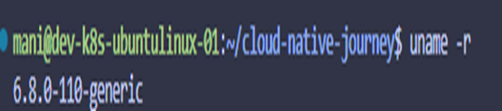  

     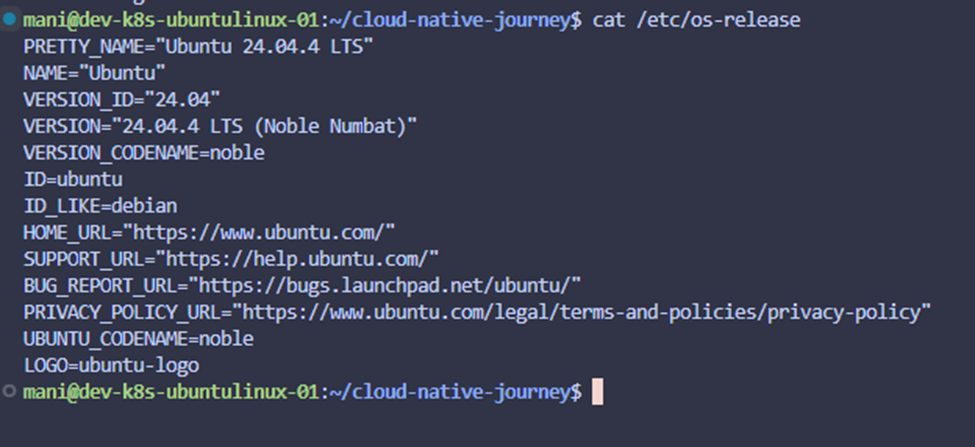           
             
                
2. CPU & Architecture Check				
CPU & Archtiecute =Command used= lscpu				
My machine shows : Architecture: *86_64				
CPU Shows: 2 CPU				
     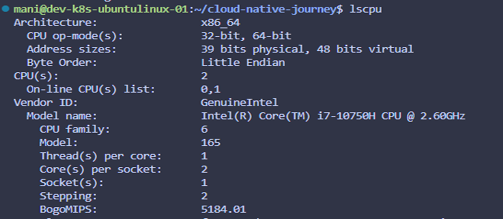           
                
3 .Memory Check				
Memory Check= Linux Command Used= free -h				
Production baseline: 				
**Minimum - 2GB				
**Recommended - 4GB+				
Swap: must exit = If swap not show: command: sudo swapon --show				
My machine shows: total 4 GB				
Available: 2.9 GB				
   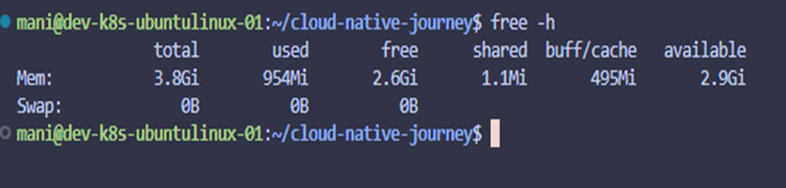  

                
4. Disk Capacity & Usage				
Disk Capacity=linux command used= df -h				
Production basline: should be minimum greater than : 10 GB free				
My machine shows: total 49 GB				
Available: 42 GB				
                
 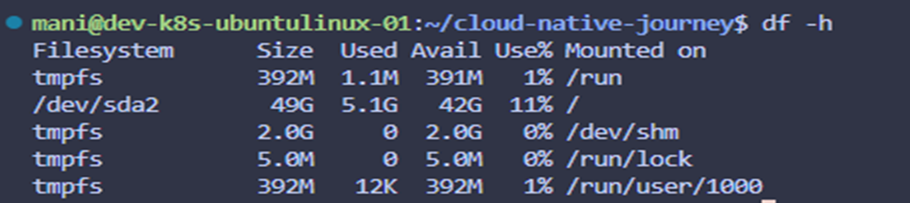               
                                
5. Filesytstem Type check				
Filesystem check=Linux command used= df -T /				
                
Only support:				
** ext4 				
** xfs (with d-typesupport)				
 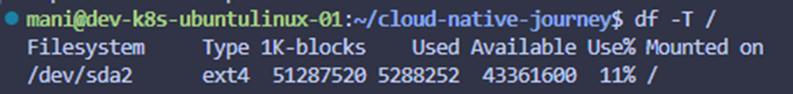

                
6. Cgroups Support				
Cgroups Support =linux command used = mount | grep cgroup				
                
Used for CPU and memory limits in containers				
   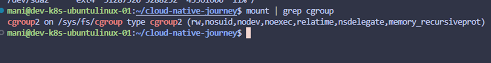             
                
                
7. Namespace Support				
Namespace Support =linux command used = ls /proc/self/ns				
This is Docker isolation mechanisam				
                
   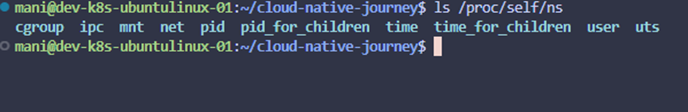             
                
                
8. Network Stack check				
Network stack =linux command used = ip a				
IT verify:				
** interface has ip				
** internet reachable				
                
   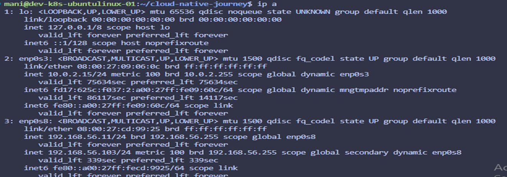             
                
                
9. Required Kernel Modules				
Kernel modules= linux command used = lsmod | grep overlay				
lsmod | grep br_netfilter				
 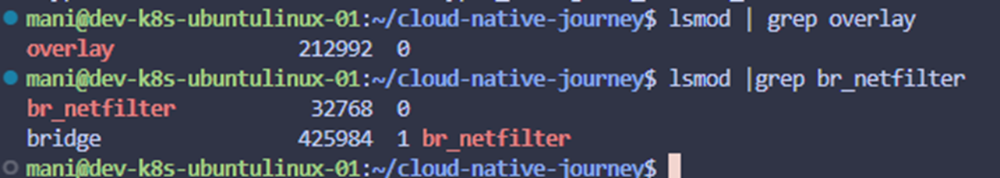               
                
                
10. check for exisitng docker install (clean state)				
exsiting docker = linux command used = dpkg -l | grep docker				
its should be empty				
                
                
11. Check disk inode availability				
disk inode aviabilability= linux command used = df -i				
Why: even with space, container failes if inodes are exahusted				
  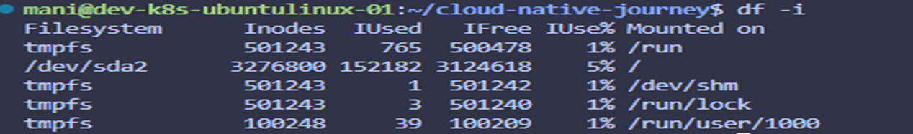              
                
                
12. Firewall Check 				
firewall chec : linux command used = sudo ufw status				
Note: docker manipulate iptables				
   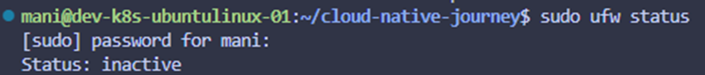             
                
                
13. system health check 				
linux command used : apt update , apt upgrade				
                
14. User Permission and sudo access				
Linux command 				
whoami				
groups				
sudo -l				
                

    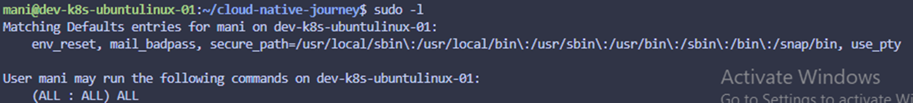            
                
15. Time synchronization				
time sync: linux command used : timedatectl				
verify : **ntp service : active				
   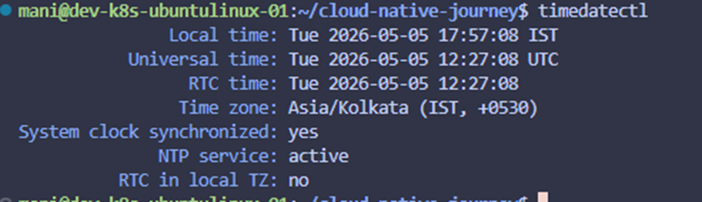             
                
                
16. Check Avilable package space				
Linux command used : df -h /var				
Why: apt+docker images both consume /var				
                
  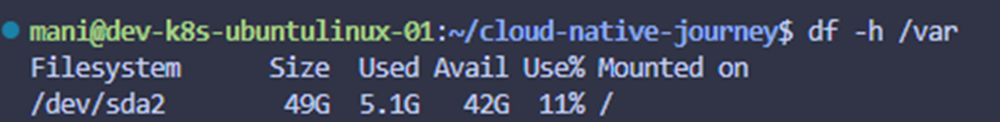              
                
                
17. Hostname & DNS check				
Linux command : hostnamectl = for hostname				
DNS = cat /etc/hosts				
  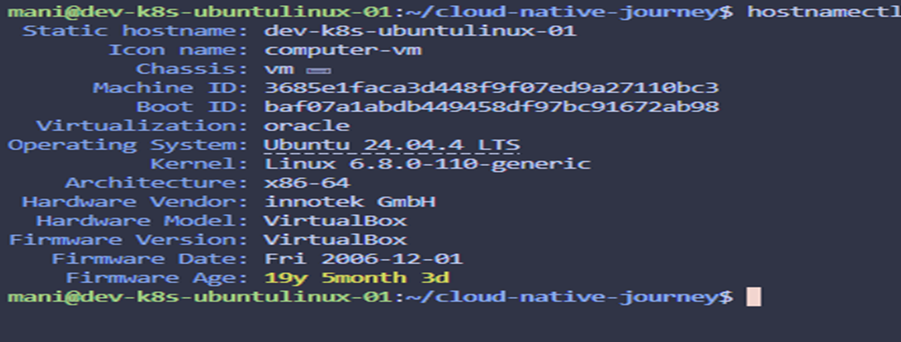              
                
                  
18. Verify virutalization				
Linux command used= systemd-detect-virt				
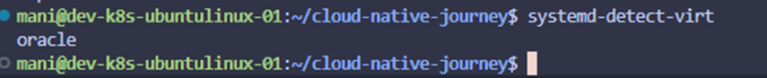