# Docker Installation & Internal Architecture Guide

---

# 1. Docker = Client + Daemon + Container Runtime

```bash
docker (CLI) + dockerd (engine) + containerd + runc + Linux kernel
```

## Components

- dockerd = Brain (runs as a service)
- containerd = Manages containers
- runc = Creates process isolation
- Linux Kernel = Actual execution layer

---

# 2. Where Does My Image Fit?

Images are read-only templates stored on disk.

```bash
Images (on disk) + containerd + runc + running container
```

## Default Docker Storage Location

```bash
/var/lib/docker/
```

## Inside This Directory We Find

- Image layers
- Container metadata
- Volumes
- Networks

---

# 3. End-to-End Lifecycle (Step by Step)

## Step 1 — Run a Docker Command

### Command

```bash
docker run nginx
```

### What Happens

- Docker CLI sends request to dockerd (brain)

---

## Step 2 — dockerd (The Brain)

### What Happens

- Checks whether image exists locally
- If image does not exist:
  - Pulls image from Docker Hub

```bash
Docker Hub → dockerd → stored locally
```

---

## Step 3 — Image Stored as Layers

### Example: nginx Image

```bash
Layer 1 → Ubuntu Base
Layer 2 → Nginx Installation
Layer 3 → Configuration
```

---

## Step 4 — containerd

### Responsibilities

- Prepares container filesystem
- Combines image layers
- Creates container metadata

---

## Step 5 — runc

### Responsibilities

Creates isolated process using:

- Namespaces → Isolation
- cgroups → Resource limitation

---

## Step 6 — Linux Kernel

### Responsibilities

- Runs process
- Isolates network
- Manages CPU & memory
- Performs actual execution

---

# 4. PHASE 1 — Clean Base System

## Step 1 — Remove Old Docker Versions

### Command

```bash
sudo apt remove -y docker docker-engine docker.io containerd runc


### What Happens

- Removes pre-installed Docker packages
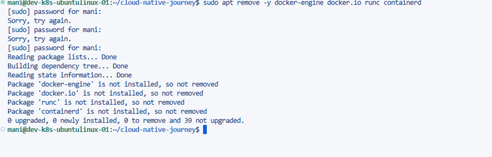

---

# 5. PHASE 2 — Secure Package Source

## Step 1 — Install Tools for Secure Download

### Command

```bash
sudo apt install -y ca-certificates curl gnupg lsb-release
```

## Why These Packages?

| Package | Purpose |
|----------|----------|
| curl | Download files |
| gnupg | Verify signatures |
| ca-certificates | HTTPS trust |

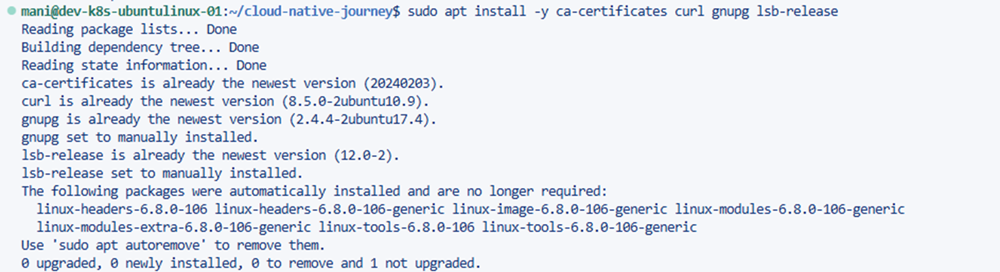
---

# Step 2 — Add Docker GPG Key

## 1. Create Trusted Key Directory

### Command

```bash
sudo mkdir -p /etc/apt/keyrings


### What This Does

- Creates trusted key folder
- `-p` = create safely if not exists

### Why?

Modern Linux systems store repository keys inside dedicated folders.

---

## 2. Download & Convert Docker GPG Key

### Command

```bash
curl -fsSL https://download.docker.com/linux/ubuntu/gpg | \
sudo gpg --dearmor -o /etc/apt/keyrings/docker.gpg
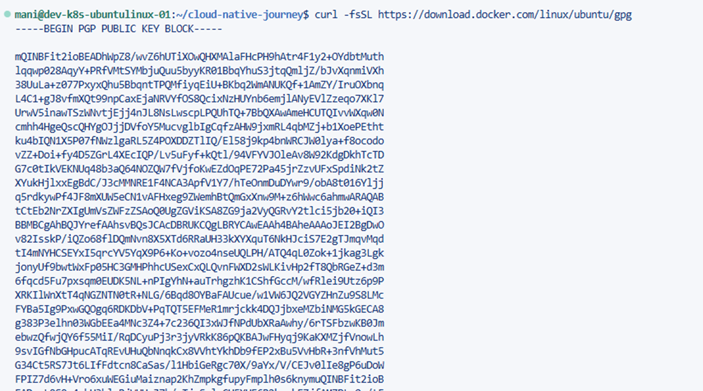

## curl Flags

| Flag | Meaning |
|------|----------|
| -f | Fail silently on error |
| -s | Silent mode |
| -S | Show errors |
| -L | Follow redirects |

---

## gpg --dearmor

Converts:

```bash
ASCII key → Binary .gpg format
```

## Saved Location

```bash
/etc/apt/keyrings/docker.gpg
```

---

## 3. Set Read Permissions

### Command

```bash
sudo chmod a+r /etc/apt/keyrings/docker.gpg
```
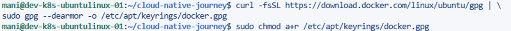

### What This Does

```bash
a+r = all users can read
```

### Why?

APT runs as a system process and must read the key.

---

## Verify Permissions

### Command

```bash
ls -l /etc/apt/keyrings/docker.gpg
```
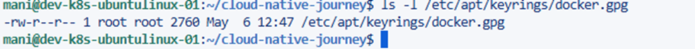
---

# Step 3 — Add Docker Repository

### Command

```bash
echo \
"deb [arch=$(dpkg --print-architecture) signed-by=/etc/apt/keyrings/docker.gpg] \
https://download.docker.com/linux/ubuntu \
$(lsb_release -cs) stable" | \
sudo tee /etc/apt/sources.list.d/docker.list > /dev/null
```

---

## Breakdown

### Part 1 — echo

Prints repository definition.

---

### Part 2 — Repository Definition

```bash
deb [arch=$(dpkg --print-architecture) signed-by=/etc/apt/keyrings/docker.gpg]
```

## Explanation

| Component | Meaning |
|------------|----------|
| deb | Binary package repository |
| arch=$(dpkg --print-architecture) | Download packages matching CPU architecture |
| signed-by=... | Use Docker trusted GPG key |

---

### Part 3 — Repository URL

```bash
https://download.docker.com/linux/ubuntu
```

---

### Part 4 — Ubuntu Version

```bash
$(lsb_release -cs)
```

Automatically inserts Ubuntu codename.

---

### Part 5 — stable

Uses stable Docker packages.

---

### Part 6 — Pipe (`|`)

Passes output from left command into right command.

---

### Part 7 — tee

### Command

```bash
sudo tee /etc/apt/sources.list.d/docker.list
```

### What Happens

Creates repository file:

```bash
/etc/apt/sources.list.d/docker.list
```

---

# PHASE 3 — Install Docker Stack

## Step 1 — Docker Install Troubleshooting

### Problem

Two files existed:

```bash
/etc/apt/sources.list.d/docker.sources
/etc/apt/sources.list.d/docker.list
```

This causes APT conflicts.

---

## Solution

### Remove `.sources` File

```bash
sudo rm -f /etc/apt/sources.list.d/docker.sources
```

---

## Verify

### Command

```bash
grep -R "download.docker.com" /etc/apt/
```

### Expected Result

```bash
/etc/apt/sources.list.d/docker.list
```
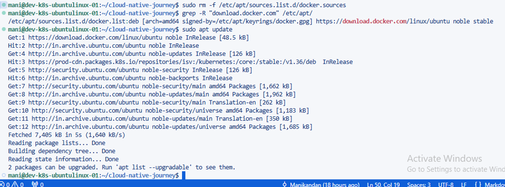
---

## Update Package List

### Command

```bash
sudo apt update
```

---

## Step 2 — Install Docker Packages

### Command

```bash
sudo apt install -y docker-ce docker-ce-cli containerd.io docker-buildx-plugin docker-compose-plugin
```
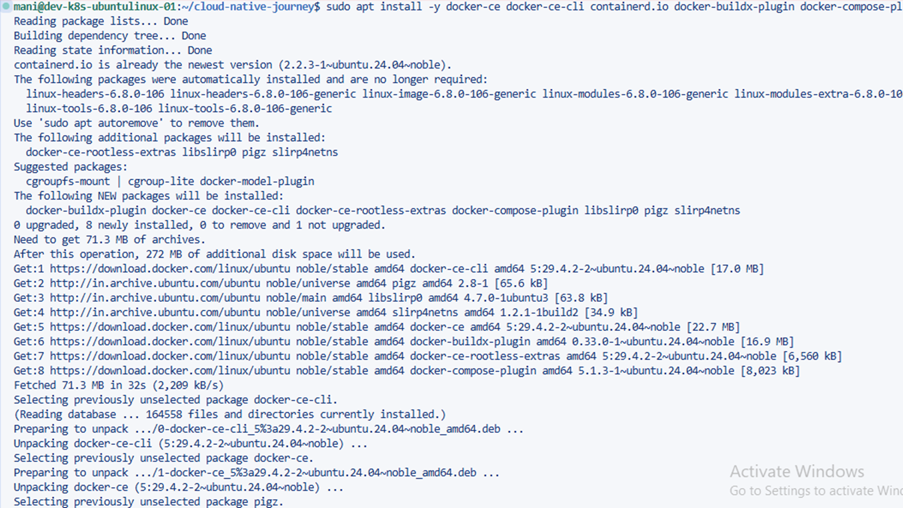
---

# What APT Does Now

1. Reads Docker repository
2. Verifies package signatures
3. Downloads packages
4. Resolves dependencies
5. Installs binaries & services
6. Registers Docker daemon with systemd

---

# Docker Package Breakdown

## 1. docker-ce

Docker Community Edition

Installs:

```bash
dockerd
```

### Role

- Receives CLI commands
- Manages images
- Manages networks
- Manages volumes
- Talks to containerd

---

## Verify dockerd

### Command

```bash
which dockerd
```

### Usually

```bash
/usr/bin/dockerd
```
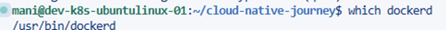
---

## 2. docker-ce-cli

Installs Docker CLI:

```bash
docker
```

---

## 3. containerd.io

Docker does NOT directly run containers.

```bash
dockerd → containerd → runc
```
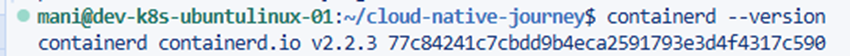

### Responsibilities

- Pulls images
- Manages lifecycle
- Handles storage
- Handles snapshots

---

## 4. docker-buildx-plugin

### Purpose

Advanced image build system.

---

## 5. docker-compose-plugin

### Purpose

Runs multi-container applications.

### Example

```bash
App + Database + Redis
```

---

# After Installation What Happens?

## Docker Service Created

### Location

```bash
/lib/systemd/system/docker.service
```

---

## Docker Socket Created

### Location

```bash
/var/run/docker.sock
```

---

## Docker Directory Created

### Location

```bash
/var/lib/docker
```

### Stores

- Images
- Containers
- Networks
- Volumes

---

# Verification Commands

## Check Docker Version

```bash
docker --version
```
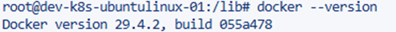
---

## Check Docker Daemon

```bash
systemctl status docker
```
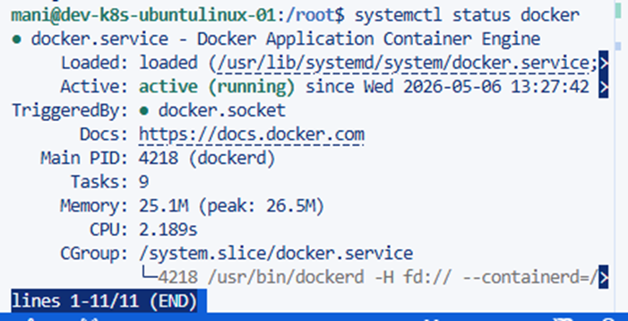
---

## Check containerd

```bash
systemctl status containerd
```
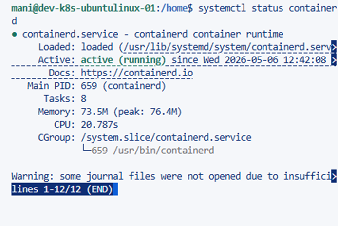
---

## Check Docker Information

```bash
docker info
```
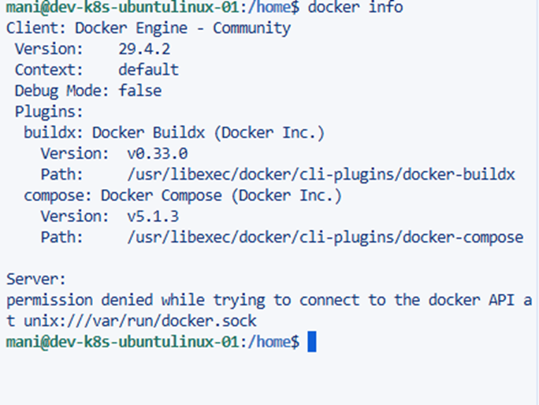
---

# Docker Component Summary

| Component | Purpose |
|------------|----------|
| docker-ce | Engine (dockerd) |
| docker-ce-cli | CLI |
| containerd | Container manager |
| runc | Low-level runtime |
| buildx | Image builder |
| compose | Multi-container orchestration |

---

# PHASE 4 — Start & Integrate with OS

## Step 1 — Start Docker Service

```bash
sudo systemctl start docker
```
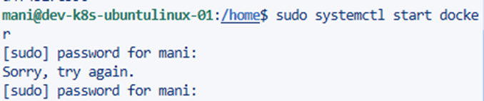
---

## Step 2 — Enable Docker on Boot

```bash
sudo systemctl enable docker
```
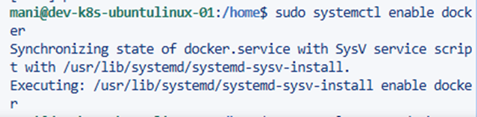
---

## Step 3 — Check Docker Status

```bash
sudo systemctl status docker
```
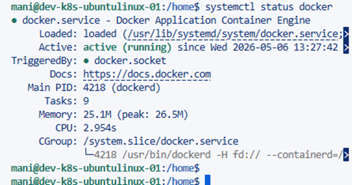
---

# PHASE 5 — User Access

## Step 1 — Add User to Docker Group

```bash
sudo usermod -aG docker $USER
```
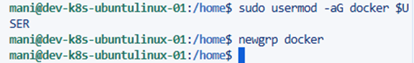

### What Happens?

Docker socket:

```bash
/var/run/docker.sock
```

### Why?

Allows Docker usage without sudo.

Without this:

```bash
sudo docker ps
```

With group access:

```bash
docker ps
```

---

# PHASE 6 — Configure Docker (Production/Professional Setup)

## Step 1 — Create Docker Daemon Configuration

### Commands

```bash
sudo mkdir -p /etc/docker
sudo nano /etc/docker/daemon.json
```
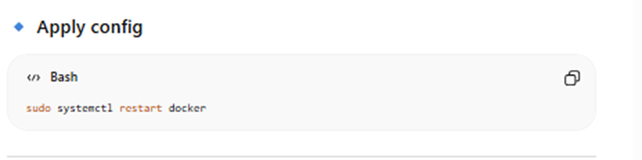
---

## daemon.json

```json
{
  "log-driver": "json-file",
  "log-opts": {
    "max-size": "50m",
    "max-file": "3"
  },
  "exec-opts": ["native.cgroupdriver=systemd"],
  "storage-driver": "overlay2",
  "live-restore": true
}
```

---

# Explanation

| Setting | Purpose |
|----------|----------|
| log-driver | Prevent disk full issues |
| max-size | Limit log file size |
| max-file | Rotate logs |
| cgroupdriver=systemd | Required for Kubernetes compatibility |
| overlay2 | Efficient layered filesystem |
| live-restore | Containers continue running after daemon restart |

---

# Apply Configuration

```bash
sudo systemctl restart docker
```

---

# PHASE 7 — Deep Verification

## Step 1 — Check Docker System Information

```bash
docker info
```
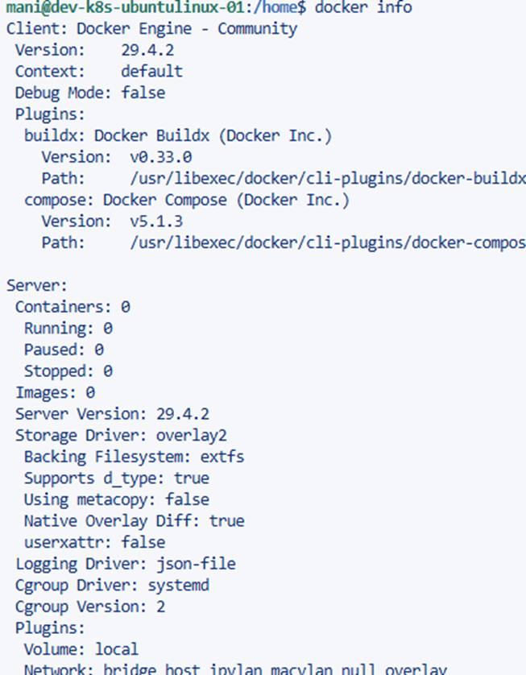
---

## Step 2 — Check Running Processes

```bash
ps aux | grep dockerd
```
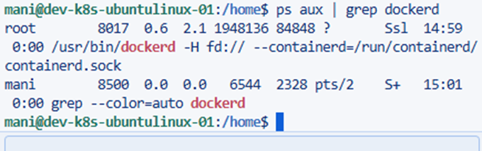
Confirms Docker daemon is running.

---

## Step 3 — Check Docker Socket

```bash
ls -l /var/run/docker.sock
```
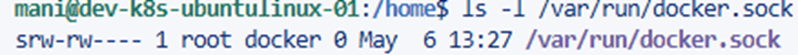
Confirms correct permissions and group access.

---

# Final Docker Runtime Flow

```bash
docker CLI
    ↓
dockerd
    ↓
containerd
    ↓
runc
    ↓
Linux Kernel
```

---

# Important Docker Paths

| Path | Purpose |
|------|----------|
| /var/lib/docker | Docker storage |
| /var/run/docker.sock | Docker socket |
| /etc/docker/daemon.json | Docker configuration |
| /lib/systemd/system/docker.service | Docker service file |
| /etc/apt/keyrings/docker.gpg | Docker trusted key |

---

# Conclusion

This setup provides:

- Production-ready Docker installation
- Secure repository configuration
- Proper runtime architecture
- Kubernetes-compatible configuration
- Professional Linux container environment