# Linux System Overview

## Learning Objective

Understand the fundamental components of a Linux operating system, how they interact with each other, and how Linux manages hardware resources, applications, users, networking, storage, and processes.

---

# What is an Operating System?

An Operating System (OS) is software that acts as an intermediary between users, applications, and hardware.

Without an operating system:

* CPU cannot be managed efficiently
* Memory cannot be allocated
* Files cannot be stored
* Applications cannot execute
* Network communication cannot occur

Examples:

* Ubuntu Linux
* Rocky Linux
* Red Hat Enterprise Linux (RHEL)
* Windows Server
* macOS

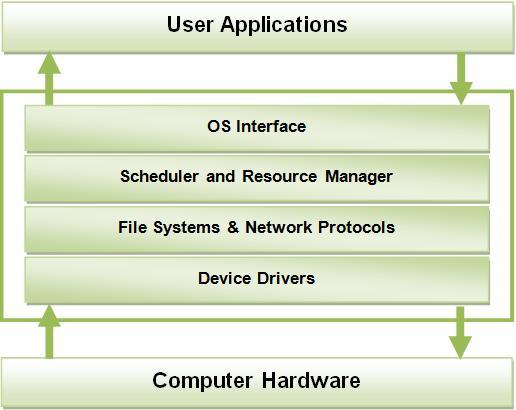


---

# Linux System Overview Diagram

```text
+----------------------+
|       Users          |
+----------------------+
           |
           v
+----------------------+
|    Applications      |
+----------------------+
           |
           v
+----------------------+
|       Shell          |
+----------------------+
           |
           v
+----------------------+
|    System Calls      |
+----------------------+
           |
           v
+----------------------+
|       Kernel         |
+----------------------+
           |
           v
+----------------------+
|      Hardware        |
+----------------------+
```
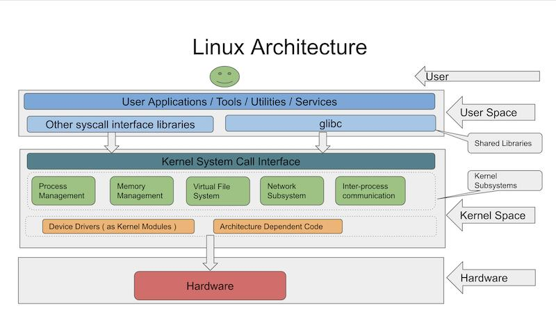
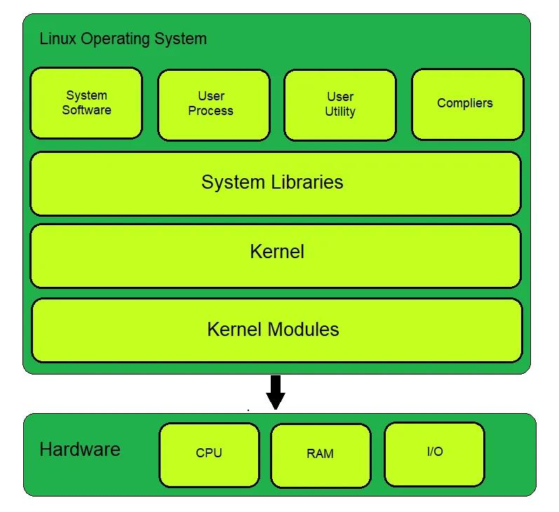
---
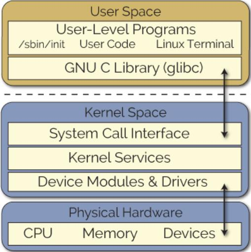


# Linux Components

## 1. Hardware

Hardware refers to physical devices attached to the system.

Examples:

* CPU
* RAM
* Hard Disk
* SSD
* Network Interface Card (NIC)
* Keyboard
* Monitor

### Commands

Check CPU Architecture:

```bash
uname -m
```

Check Storage Devices:

```bash
lsblk
```

Check Memory:

```bash
free -h
```

---

## 2. Kernel

The Kernel is the core component of Linux.

It directly communicates with hardware and manages system resources.

### Responsibilities

* CPU Scheduling
* Memory Management
* Device Management
* Filesystem Management
* Networking
* Process Management
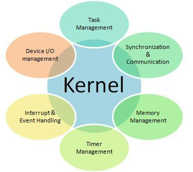
### Commands

Check Kernel Version:

```bash
uname -r
```

Example:

```text
6.8.0-124-generic
```

---

## 3. Shell

The Shell is a command interpreter.

It accepts user commands and communicates with the kernel.

Examples:

* bash
* sh
* zsh
* ksh

### Commands

Check Current Shell:

```bash
echo $SHELL
```

Example:

```text
/bin/bash
```
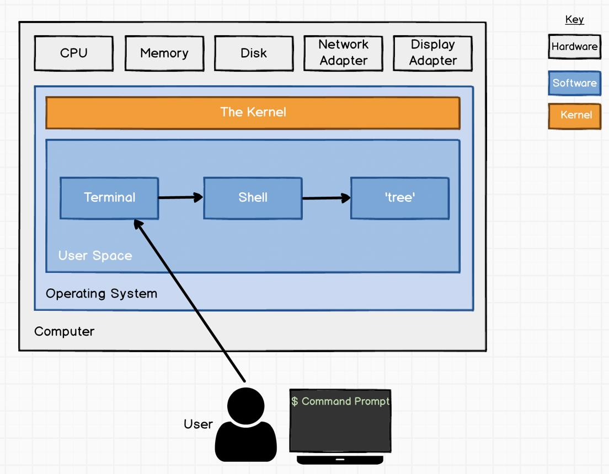
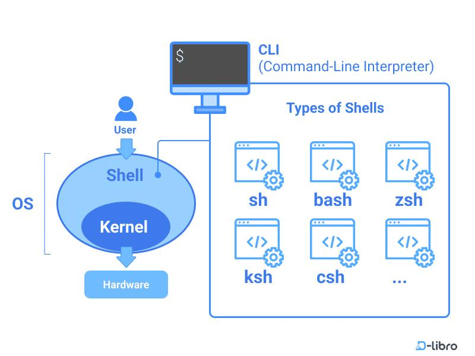

---

## 4. Filesystem

Linux stores everything as files.

Common directories:

```text
/etc
/home
/var
/proc
/sys
/dev
/usr
```

### Commands

Display Root Directories:

```bash
ls /
```

---

## 5. Processes

A process is a running instance of a program.

Examples:

* sshd
* bash
* systemd
* docker

### Commands

Display Running Processes:

```bash
ps -ef
```

Real-Time Monitoring:

```bash
top
```

Advanced Monitoring:

```bash
htop
```

---

## 6. Services

Services are background processes managed by systemd.

Examples:

* ssh
* cron
* docker
* nginx

### Commands

Check Service Status:

```bash
systemctl status ssh
```

List Services:

```bash
systemctl list-units
```

---

## 7. Users

Linux is a multi-user operating system.

### Commands

Current User:

```bash
whoami
```

View User Database:

```bash
cat /etc/passwd
```

---

## 8. Networking

Linux manages network communication.

Components:

* IP Address
* DNS
* Routing
* ARP
* Network Interfaces

### Commands

Show IP Addresses:

```bash
ip a
```

Show Routes:

```bash
ip route
```

Show ARP Table:

```bash
ip neigh
```

Connectivity Test:

```bash
ping google.com
```

---

# How Linux Executes a Command

Example:

```bash
free -h
```

Execution Flow:

```text
User
 ↓
Shell
 ↓
System Call
 ↓
Kernel
 ↓
Memory Manager
 ↓
Shell
 ↓
Output on Screen
```
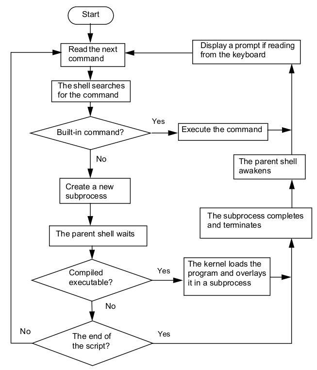
---

# System Calls

System Calls are interfaces between User Space and Kernel Space.

Examples:

```text
open()
read()
write()
fork()
exec()
close()
```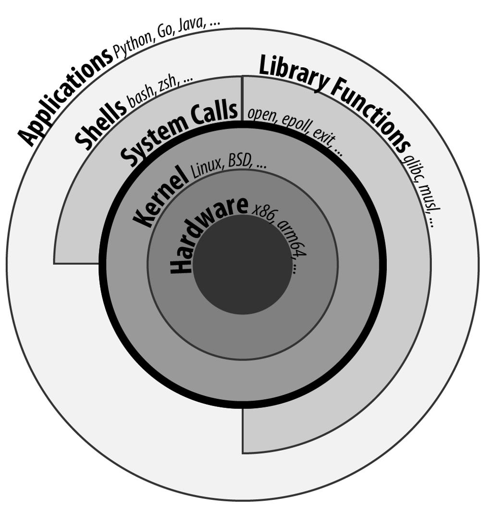

Applications use these calls to request services from the kernel.

---

# User Space vs Kernel Space

## User Space

Runs applications:

* VS Code
* Docker CLI
* kubectl
* Firefox
* bash

## Kernel Space

Runs:

* CPU Scheduler
* Memory Manager
* Filesystem Drivers
* Network Stack
* Device Drivers
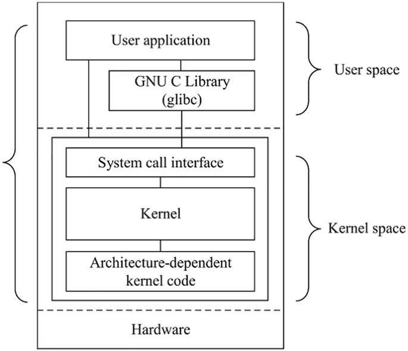
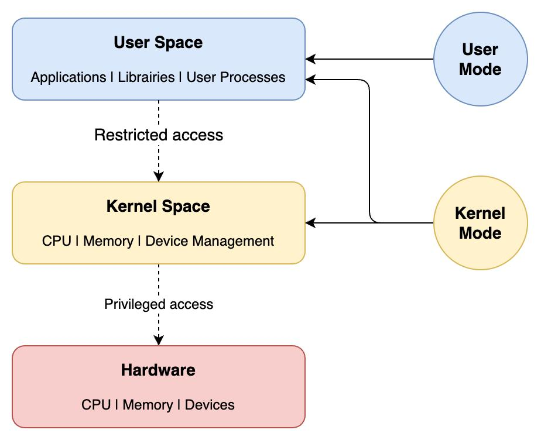

---

# Important Linux Commands

## Operating System Information

```bash
cat /etc/os-release
```

---

## Host Information

```bash
hostnamectl
```

---

## Kernel Information

```bash
uname -r
```

---

## Memory Information

```bash
free -h
```

---

## CPU Architecture

```bash
uname -m
```

---

## Storage Devices

```bash
lsblk
```

---

## Filesystem Usage

```bash
df -h
```

---

## Uptime

```bash
uptime
```

---

## Network Interfaces

```bash
ip a
```

---

# Practical Exercises

## Exercise 1

Verify OS Information:

```bash
cat /etc/os-release
```

Questions:

* Which Linux distribution?
* Which version?
* Which release codename?

---

## Exercise 2

Verify Kernel:

```bash
uname -r
```

Questions:

* Which kernel version is running?

---

## Exercise 3

Verify Memory:

```bash
free -h
```

Questions:

* Total Memory?
* Available Memory?
* Swap Configured?

---

## Exercise 4

Verify Storage:

```bash
lsblk
df -h
```

Questions:

* Disk Size?
* Root Filesystem Usage?

---

## Exercise 5

Verify Networking:

```bash
ip a
ip route
```

Questions:

* Primary IP?
* Default Gateway?

---

# Production Scenarios

## Scenario 1 - High CPU Usage

Commands:

```bash
top
htop
ps -ef
```

Purpose:

Identify CPU-consuming processes.

---

## Scenario 2 - High Memory Usage

Commands:

```bash
free -h
cat /proc/meminfo
```

Purpose:

Identify memory pressure.

---

## Scenario 3 - Disk Full

Commands:

```bash
df -h
du -sh /*
```

Purpose:

Identify storage consumption.

---

## Scenario 4 - SSH Service Down

Commands:

```bash
systemctl status ssh
journalctl -xe
```

Purpose:

Verify service health.

---

## Scenario 5 - Network Connectivity Issue

Commands:

```bash
ip a
ip route
ping
```

Purpose:

Verify interfaces and routing.

---

# Interview Questions

## What is Linux?

Linux is an open-source operating system that manages hardware resources and provides services to applications and users.

---

## What is a Kernel?

The kernel is the core component of Linux responsible for managing CPU, memory, storage, networking, and devices.

---

## What is a Shell?

A shell is a command interpreter that accepts user commands and communicates with the kernel.

---

## Difference Between Kernel and Shell

| Kernel           | Shell             |
| ---------------- | ----------------- |
| Core OS          | Command Interface |
| Manages Hardware | Executes Commands |
| Kernel Space     | User Space        |

---

## What Happens When You Execute a Command?

```text
User
 ↓
Shell
 ↓
System Call
 ↓
Kernel
 ↓
Hardware Resource
 ↓
Output
```

---

## What is a Process?

A process is a running instance of a program.

Example:

```bash
ps -ef
```

---

## What is a Service?

A service is a background process managed by systemd.

Example:

```bash
systemctl status ssh
```

---

# Kubernetes Relevance

Every Kubernetes Node is a Linux Server.

Kubernetes depends on:

* Linux Kernel
* Processes
* Networking
* Filesystems
* Storage
* Services
* Systemd

Without Linux fundamentals, Kubernetes administration becomes difficult.

---

# Summary

After completing this chapter,i have understand:

* Operating System Fundamentals
* Linux Components
* Kernel
* Shell
* Filesystem
* Processes
* Services
* Users
* Networking
* System Calls
* User Space
* Kernel Space
* Basic Troubleshooting
* Production Relevance

This forms the foundation for Linux Administration, Docker, Kubernetes, AKS, and Platform Engineering.

# Linux System Overview


