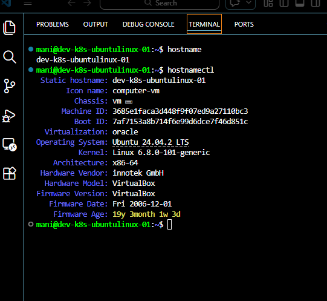
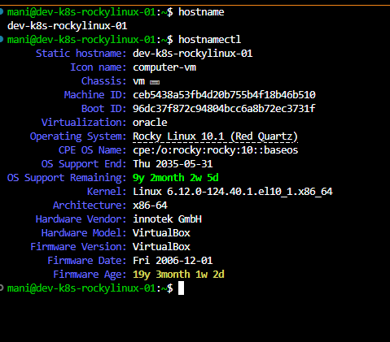

# Hostname Configuration

## Objective

Configure meaningful hostnames for Linux servers to simplify server identification, administration, monitoring, and troubleshooting.

---

# What is a Hostname?

A hostname is the unique name assigned to a Linux system.

It helps administrators identify servers in a network environment.

Example:

```text
dev-k8s-ubuntulinux-01
```

Instead of:

```text
192.168.56.11
```

Using hostnames makes server management easier.

---

# Why Hostnames are Important?

Benefits:

* Easy server identification
* Better troubleshooting
* Monitoring integration
* Logging clarity
* Production server management

Example:

```text
web-server-01
db-server-01
k8s-master-01
k8s-worker-01
```

---

# Check Current Hostname

Command:

```bash
hostname
```

or

```bash
hostnamectl
```

Example Output:

```text
Static hostname: ubuntu
```

---

# Configure Ubuntu Hostname

Set hostname:

```bash
sudo hostnamectl set-hostname dev-k8s-ubuntulinux-01
```

Verify:

```bash
hostnamectl
```

Expected Output:

```text
Static hostname: dev-k8s-ubuntulinux-01
```

---

# Configure Rocky Linux Hostname

Set hostname:

```bash
sudo hostnamectl set-hostname dev-k8s-rockylinux-01
```

Verify:

```bash
hostnamectl
```

Expected Output:

```text
Static hostname: dev-k8s-rockylinux-01
```

---

# Verify Hostname

Commands:

```bash
hostname
hostnamectl
```

Expected:

Ubuntu:

```text
dev-k8s-ubuntulinux-01
```

Rocky Linux:

```text
dev-k8s-rockylinux-01
```

---

# Hostname Types in Linux

Linux maintains three hostname types.

View them:

```bash
hostnamectl
```

### Static Hostname

Permanent hostname stored on disk.

Example:

```text
dev-k8s-ubuntulinux-01
```

---

### Transient Hostname

Temporary hostname assigned by DHCP.

---

### Pretty Hostname

Human-readable hostname.

Example:

```text
Development Kubernetes Ubuntu Server
```

Configure:

```bash
sudo hostnamectl set-hostname "Development Kubernetes Ubuntu Server" --pretty
```

---

# Hostname Configuration File

Location:

```bash
/etc/hostname
```

View:

```bash
cat /etc/hostname
```

Example:

```text
dev-k8s-ubuntulinux-01
```

---

# Update Local Name Resolution

File:

```bash
/etc/hosts
```

Edit:

```bash
sudo nano /etc/hosts
```

Example:

```text
127.0.0.1 localhost
127.0.1.1 dev-k8s-ubuntulinux-01
```

For Rocky Linux:

```text
127.0.1.1 dev-k8s-rockylinux-01
```

---

# Troubleshooting

## Hostname Not Updated

Verify:

```bash
hostnamectl
```

Restart session:

```bash
logout
```

or

```bash
sudo reboot
```

---

## Verify Configuration Files

```bash
cat /etc/hostname
cat /etc/hosts
```

---

# Best Practices

Use meaningful naming conventions.

Examples:

```text
dev-k8s-ubuntulinux-01
dev-k8s-rockylinux-01
prod-web-server-01
prod-db-server-01
```

Avoid:

```text
server1
linuxbox
test
```



---

# Learning Outcome

Successfully configured hostnames for Ubuntu and Rocky Linux servers using hostnamectl and verified system identity for production-style Linux administration.
