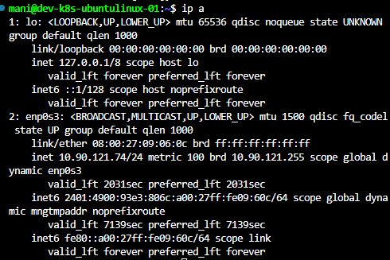
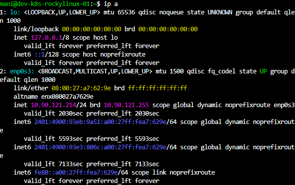

# Network Configuration

## Objective

Configure networking for Linux virtual machines and ensure connectivity between the host system, virtual machines, and the internet.

---

# What is Networking?

Networking enables communication between:

* Computers
* Servers
* Applications
* Containers
* Kubernetes Nodes

Every Linux server requires proper network configuration for production usage.

---

# Verify Network Configuration

Check IP Address:

```bash
ip a
```

Check Routing Table:

```bash
ip route
```

Check DNS Configuration:

```bash
cat /etc/resolv.conf
```

---

# Initial Observation

While checking both virtual machines:

```text
Ubuntu VM
10.0.2.15

Rocky Linux VM
10.0.2.15
```

Both machines received similar NAT-based addresses from VirtualBox.

---

# Understanding NAT Networking

Default VirtualBox Network Mode:

```text
NAT (Network Address Translation)
```

Advantages:

* Internet access works immediately
* Easy setup
* Suitable for testing

Limitations:

* Host cannot directly access VM
* VM-to-VM communication is difficult
* SSH access becomes complicated

---

# NAT Network Architecture

```text
Host Machine
      |
VirtualBox NAT
      |
-----------------
|               |
Ubuntu VM
Rocky VM
```

---

# Why NAT Was Not Suitable

Requirements:

* SSH Access
* VS Code Remote SSH
* Linux Administration Labs
* Docker Networking
* Kubernetes Practice

NAT mode was not ideal for these requirements.

---

# Solution: Bridged Adapter

Changed Network Adapter Mode:

```text
NAT
     ↓
Bridged Adapter
```

---

# What is a Bridged Adapter?

Bridged networking allows the virtual machine to appear as an independent device on the physical network.

Benefits:

* Receives real IP address
* Host can communicate with VM
* SSH access works
* Suitable for Kubernetes labs

---

# Configure Bridged Adapter

VirtualBox:

```text
Settings
  →
Network
  →
Adapter 1
  →
Bridged Adapter
```

Select:

```text
Wi-Fi Adapter
or
Ethernet Adapter
```

Save configuration.

---

# Verify New IP Address

Command:

```bash
ip a
```

---

# Rocky Linux IP

Example:

```text
10.90.121.214/24
```

---

# Ubuntu Linux IP

Example:

```text
10.90.121.74/24
```

---

# Verify Connectivity

Ping Gateway:

```bash
ping -c 4 10.90.121.1
```

Ping Internet:

```bash
ping -c 4 8.8.8.8
```

Ping Google DNS:

```bash
ping google.com
```

---

# Verify Routing

Command:

```bash
ip route
```

Example:

```text
default via 10.90.121.1
```

This route is used for internet traffic.

---

# Important Networking Commands

Display IP Address:

```bash
ip a
```

Display Routes:

```bash
ip route
```

Display Active Connections:

```bash
ss -tulpn
```

Display DNS Configuration:

```bash
cat /etc/resolv.conf
```

Check Connectivity:

```bash
ping
```

---

# Troubleshooting

## No Internet Access

Check:

```bash
ip a
ip route
```

Verify gateway exists.

---

## Unable to Ping

Verify:

```bash
ping 8.8.8.8
```

If this fails:

* Adapter disconnected
* Incorrect gateway
* Firewall issue

---

## Incorrect IP Address

Renew network:

Ubuntu:

```bash
sudo netplan apply
```

Rocky Linux:

```bash
sudo systemctl restart NetworkManager
```



---

# Learning Outcome

Successfully configured networking for Ubuntu and Rocky Linux virtual machines.

Achievements:

* Understood NAT networking
* Understood Bridged networking
* Assigned real network IP addresses
* Verified internet connectivity
* Prepared environment for SSH, Docker, and Kubernetes labs
