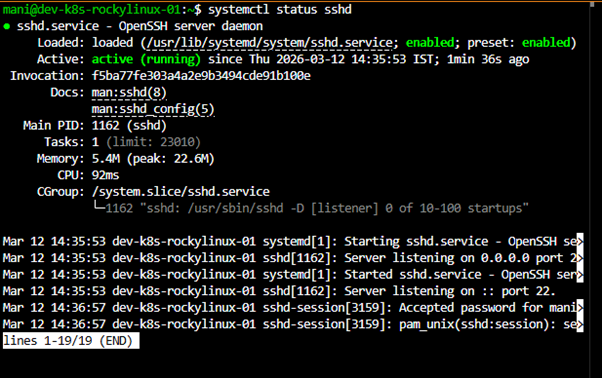

# SSH Setup

## Objective

Configure Secure Shell (SSH) on Linux servers to enable secure remote administration and management.

SSH is the primary method used by Linux administrators, DevOps engineers, cloud engineers, and Kubernetes administrators to access servers remotely.

---

# What is SSH?

SSH stands for:

```text
Secure Shell
```

SSH provides:

* Encrypted remote login
* Secure file transfer
* Remote command execution
* Server administration

Default Port:

```text
22
```

---

# Why SSH is Important?

Benefits:

* Secure communication
* Remote administration
* VS Code Remote Development
* Automation
* Infrastructure Management

Without SSH:

```text
No remote Linux administration
No cloud server access
No Kubernetes node access
```

---

# SSH Architecture

```text
SSH Client
      │
      │ Port 22
      │
SSH Server
```

Example:

```text
Laptop
   │
   │ SSH
   │
Ubuntu Server
```

---

# Install SSH Server (Ubuntu)

Update packages:

```bash
sudo apt update
```

Install OpenSSH:

```bash
sudo apt install openssh-server -y
```


---

# Verify Installation

Check package:

```bash
dpkg -l | grep openssh
```

---

# Start SSH Service

```bash
sudo systemctl start ssh
```

Enable service at boot:

```bash
sudo systemctl enable ssh
```

Verify:

```bash
systemctl status ssh
```

Expected:

```text
active (running)
```

---

# Install SSH Server (Rocky Linux)

Install package:

```bash
sudo dnf install openssh-server -y
```

Start service:

```bash
sudo systemctl start sshd
```

Enable at boot:

```bash
sudo systemctl enable sshd
```

Verify:

```bash
systemctl status sshd
```

Expected:

```text
active (running)
```

---

# Check Listening Port

Command:

```bash
ss -tulpn | grep ssh
```

Expected:

```text
Port 22
```

---

# Verify Firewall

Ubuntu:

```bash
sudo ufw allow ssh
```

Rocky Linux:

```bash
sudo firewall-cmd --permanent --add-service=ssh
sudo firewall-cmd --reload
```

---

# Find Server IP Address

Command:

```bash
ip a
```

Example:

```text
Ubuntu:
10.90.121.74

Rocky:
10.90.121.214
```

---

# Connect Using SSH

From another machine:

```bash
ssh mani@10.90.121.74
```

Rocky Linux:

```bash
ssh mani@10.90.121.214
```

---

# First Login

When connecting first time:

```text
Are you sure you want to continue connecting?
```

Type:

```text
yes
```

Enter password.

---

# Verify Logged-In User

```bash
whoami
```

Verify Hostname:

```bash
hostname
```

---

# SSH Configuration File

Location:

```bash
/etc/ssh/sshd_config
```

View:

```bash
sudo nano /etc/ssh/sshd_config
```

---

# Important SSH Settings

Default Port:

```text
22
```

Root Login:

```text
PermitRootLogin no
```

Password Authentication:

```text
PasswordAuthentication yes
```

---

# Restart SSH Service

Ubuntu:

```bash
sudo systemctl restart ssh
```

Rocky Linux:

```bash
sudo systemctl restart sshd
```

---

# Troubleshooting

## SSH Service Not Running

Check:

```bash
systemctl status ssh
```

Start:

```bash
sudo systemctl start ssh
```

---

## Connection Refused

Check:

```bash
ss -tulpn | grep ssh
```

Verify firewall rules.

---

## Wrong IP Address

Verify:

```bash
ip a
```

---

## Authentication Failed

Check:

* Username
* Password
* SSH service status

---

# Security Best Practices

* Disable root login
* Use strong passwords
* Use SSH keys
* Restrict unnecessary access
* Keep OpenSSH updated

---

# Learning Outcome

Successfully installed and configured SSH on Ubuntu and Rocky Linux servers.

Achievements:

* Installed OpenSSH
* Started SSH service
* Enabled service at boot
* Verified remote connectivity
* Prepared servers for remote administration
* Enabled foundation for VS Code Remote SSH
