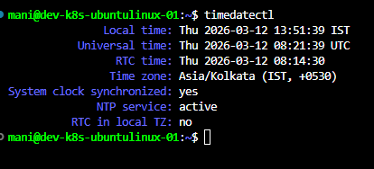
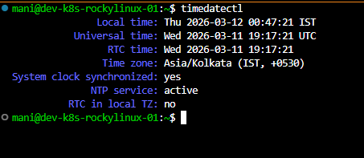
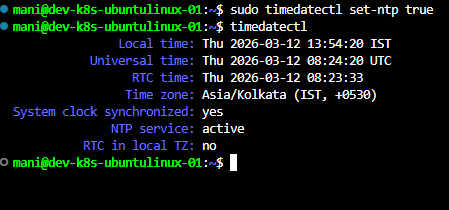
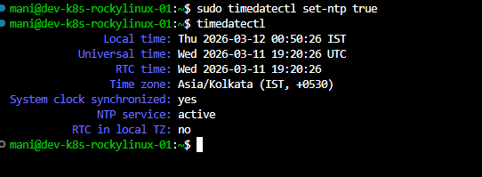

# Time Synchronization

## Objective

Configure and verify accurate system time synchronization on Linux servers.

Accurate time is critical in production environments because many services depend on correct timestamps.

---

# Why Time Synchronization is Important

Time synchronization ensures:

* Accurate logging
* Authentication validity
* Certificate validation
* Cluster coordination
* Distributed system consistency
* Monitoring accuracy

Incorrect system time can cause:

* Login failures
* SSL certificate errors
* Kubernetes issues
* Database replication problems
* Monitoring inconsistencies

---

# Check Current Time Configuration

Command:

```bash
timedatectl
```

Example Output:

```text
Local time: Tue 2026-06-02
Time zone: Asia/Kolkata
NTP service: active
System clock synchronized: yes
```

---

# Understanding NTP

NTP stands for:

```text
Network Time Protocol
```

Purpose:

Synchronizes system time with trusted time servers.

Benefits:

* Accurate timestamps
* Consistent logging
* Cluster synchronization
* Secure authentication

---

# Verify NTP Status

Command:

```bash
timedatectl status
```

Check:

```text
System clock synchronized: yes
NTP service: active
```

---

# Enable NTP Synchronization

Command:

```bash
sudo timedatectl set-ntp true
```

Verify:

```bash
timedatectl
```

Expected:

```text
NTP service: active
System clock synchronized: yes
```

---

# Check Time Zone

Command:

```bash
timedatectl
```

Example:

```text
Time zone: Asia/Kolkata (IST)
```

---

# Display Available Time Zones

Command:

```bash
timedatectl list-timezones
```

Example:

```bash
timedatectl list-timezones | grep Asia
```

---

# Change Time Zone

Example:

```bash
sudo timedatectl set-timezone Asia/Kolkata
```

Verify:

```bash
timedatectl
```

---

# Time Synchronization Service

Ubuntu uses:

```text
systemd-timesyncd
```

Check service:

```bash
systemctl status systemd-timesyncd
```

Expected:

```text
active (running)
```

---

# Verify Time Servers

Command:

```bash
timedatectl show-timesync
```

Useful information:

* NTP Server
* Poll Interval
* Synchronization Status

---

# Common Verification Commands

Current Time:

```bash
date
```

Time Configuration:

```bash
timedatectl
```

Time Synchronization Service:

```bash
systemctl status systemd-timesyncd
```

---

# Troubleshooting

## NTP Not Active

Enable NTP:

```bash
sudo timedatectl set-ntp true
```

Restart Service:

```bash
sudo systemctl restart systemd-timesyncd
```

---

## Wrong Time Zone

Check:

```bash
timedatectl
```

Set Correct Time Zone:

```bash
sudo timedatectl set-timezone Asia/Kolkata
```

---

## Clock Not Synchronized

Check Network Connectivity:

```bash
ping 8.8.8.8
```

Verify NTP Service:

```bash
systemctl status systemd-timesyncd
```

---

# Production Best Practices

* Always enable NTP
* Use correct time zone
* Verify synchronization regularly
* Monitor time drift
* Keep system clocks synchronized across servers

---

# Learning Outcome

Successfully configured and verified time synchronization on Linux servers.

Achievements:

* Understood NTP
* Enabled time synchronization
* Verified system clock
* Configured time zone
* Prepared servers for production workloads
