# VirtualBox Installation

## Objective

Install Oracle VirtualBox to create Linux virtual machines for learning Linux, Docker, Kubernetes, and DevOps technologies.

---

# What is VirtualBox?

VirtualBox is a free and open-source hypervisor developed by Oracle.

It allows multiple operating systems to run on a single physical machine as virtual machines (VMs).

Examples:

* Ubuntu Linux
* Rocky Linux
* Windows Server
* Debian
* CentOS

---

# Why VirtualBox?

Benefits:

* Free to use
* Easy VM management
* Snapshot support
* Networking support
* Cross-platform
* Suitable for Linux labs

---

# System Requirements

Minimum Requirements:

| Component      | Requirement                |
| -------------- | -------------------------- |
| CPU            | 64-bit Processor           |
| RAM            | 8 GB Recommended           |
| Storage        | 100 GB Free Space          |
| Virtualization | Intel VT-x / AMD-V Enabled |

---

# Verify Virtualization Support

## Windows

Open Task Manager:

```text
Performance → CPU
```

Verify:

```text
Virtualization : Enabled
```

---

# Download VirtualBox

Official Website:

https://www.virtualbox.org

Downloads:

* VirtualBox Platform Package
* VirtualBox Extension Pack

---

# Install VirtualBox

## Step 1

Download VirtualBox installer.

## Step 2

Run installer as Administrator.

## Step 3

Accept default options.

## Step 4

Complete installation.

## Step 5

Install Extension Pack.

---

# VirtualBox Extension Pack

Provides:

* USB 2.0 / 3.0 Support
* Virtual Disk Encryption
* Remote Desktop Protocol (RDP)
* PXE Boot Support

Installation:

```text
File → Tools → Extension Pack Manager
```

Install downloaded Extension Pack.

---

# Creating a Virtual Machine

## Example: Ubuntu VM

### Name

```text
Ubuntu-Lab
```

### Type
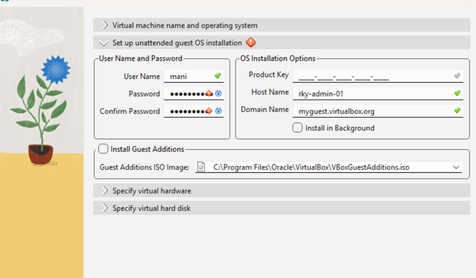
```text
Linux
```

### Version

```text
Ubuntu (64-bit)
```

### RAM

```text
4096 MB
```

### CPU

```text
2 vCPUs
```
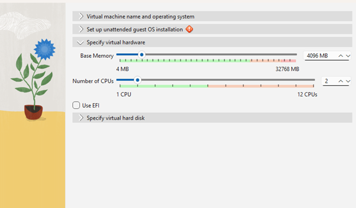
### Disk

```text
50 GB VDI
```
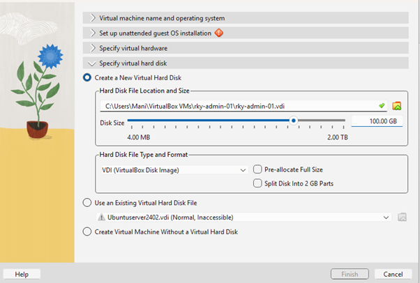
---

# Recommended Lab Configuration

## Ubuntu VM

| Resource | Value |
| -------- | ----- |
| CPU      | 2     |
| RAM      | 4 GB  |
| Disk     | 50 GB |

## Rocky Linux VM

| Resource | Value |
| -------- | ----- |
| CPU      | 2     |
| RAM      | 4 GB  |
| Disk     | 50 GB |

---

# Networking Configuration

### Adapter 1

```text
NAT
```

Purpose:

* Internet access

### Adapter 2

```text
Host-Only Adapter
```

Purpose:

* Communication between host and virtual machines

---

# Common Issues

## Virtualization Disabled

Error:

```text
VT-x is not available
```

Solution:

Enable virtualization in BIOS.

---

## Hyper-V Conflict

Error:

```text
VirtualBox cannot start VM
```

Solution:

Disable Hyper-V:

```powershell
bcdedit /set hypervisorlaunchtype off
```

Restart system.
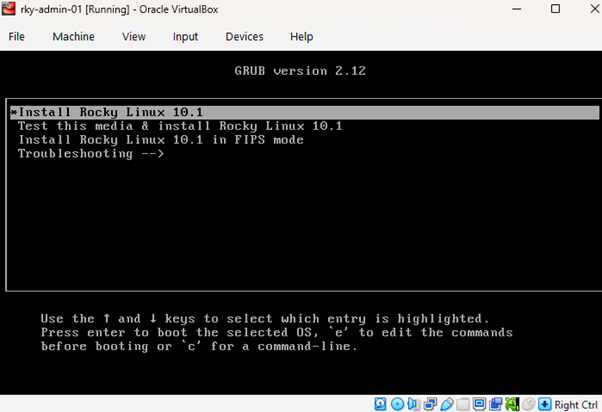
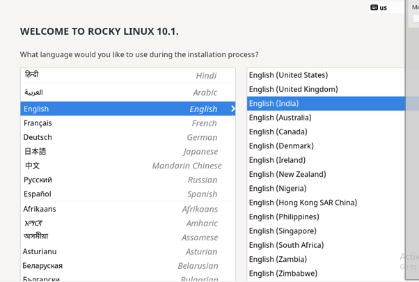

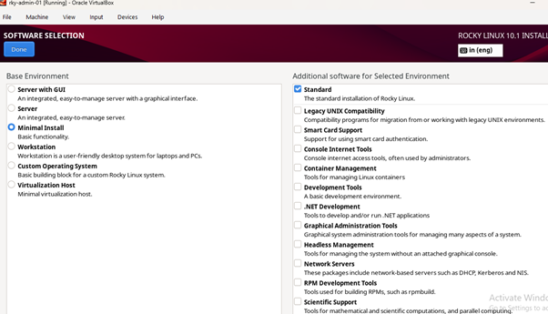
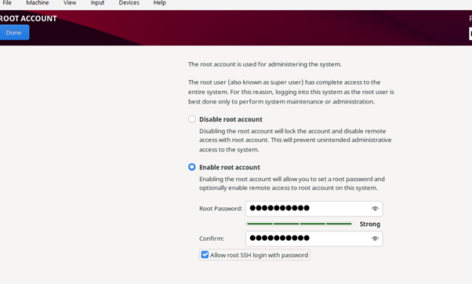
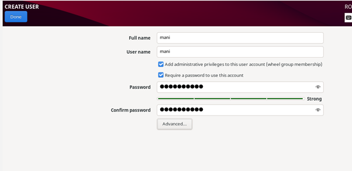
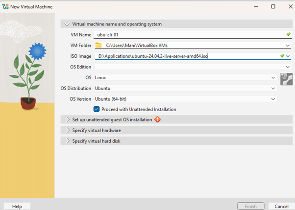
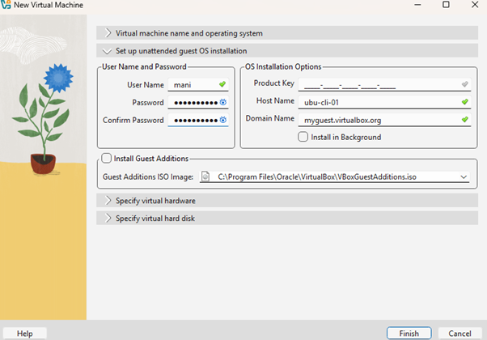
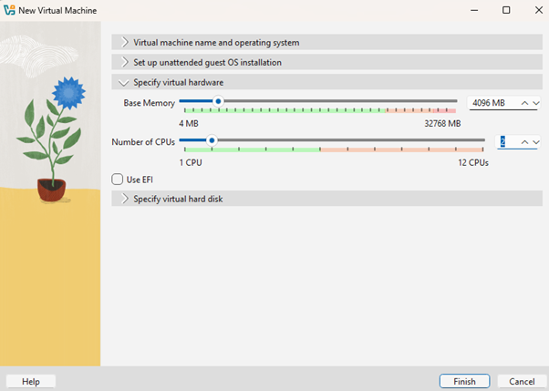
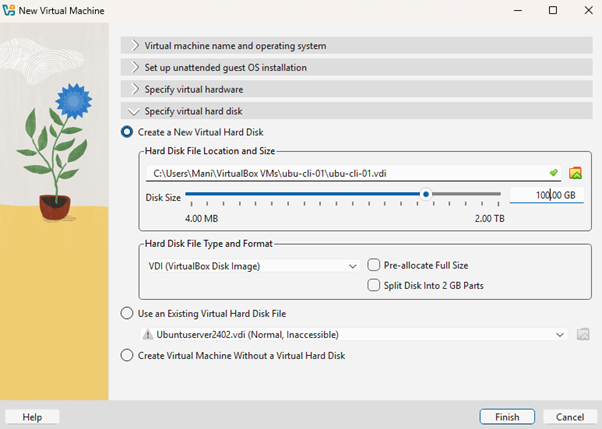
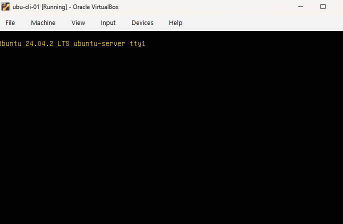

---

# Learning Outcome

Successfully installed Oracle VirtualBox and prepared the virtualization platform required for Linux server provisioning and DevOps labs.
