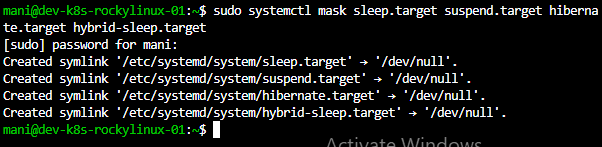

# VS Code Remote SSH

## Objective

Configure Visual Studio Code Remote SSH to manage Linux servers directly from VS Code.

This allows administrators and DevOps engineers to edit files, execute commands, and manage servers remotely from a local workstation.

---

# What is VS Code Remote SSH?

VS Code Remote SSH is an extension that enables VS Code to connect directly to remote Linux servers using SSH.

Benefits:

* Remote file editing
* Integrated terminal access
* Server administration
* Development workflows
* Docker and Kubernetes management

---

# Architecture

```text
VS Code
    │
    │ SSH
    │
Linux Server
```

Example:

```text
Windows Laptop
      │
      │ SSH
      │
Ubuntu VM
```

---

# Prerequisites

Before configuring Remote SSH:

* Linux VM installed
* SSH Server installed
* SSH Service running
* Network connectivity available
* VS Code installed

Verify SSH:

```bash
systemctl status ssh
```

Expected:

```text
active (running)
```

---

# Install VS Code

Download:

```text
https://code.visualstudio.com
```

Install using default settings.

---

# Install Remote SSH Extension

Open VS Code.

Navigate:

```text
Extensions
   →
Search
   →
Remote - SSH
```

Install:

```text
Remote - SSH
```

Published By:

```text
Microsoft
```

---

# Configure SSH Connection

Open Command Palette:

```text
Ctrl + Shift + P
```

Select:

```text
Remote-SSH: Open SSH Configuration File
```

---

# SSH Configuration File

Location:

```text
~/.ssh/config
```

---

# Ubuntu Configuration

```bash
Host ubuntu-lab
    HostName 10.90.121.74
    User mani
    Port 22
```

---

# Rocky Linux Configuration

```bash
Host rocky-lab
    HostName 10.90.121.214
    User mani
    Port 22
```

---

# Verify SSH Connectivity

Test Ubuntu:

```bash
ssh mani@10.90.121.74
```

Test Rocky Linux:

```bash
ssh mani@10.90.121.214
```

---

# Connect Using VS Code

Open Command Palette:

```text
Ctrl + Shift + P
```

Select:

```text
Remote-SSH: Connect to Host
```

Choose:

```text
ubuntu-lab
```

or

```text
rocky-lab
```

---

# First Connection

VS Code will:

* Verify host fingerprint
* Install VS Code Server
* Establish SSH connection

Select:

```text
Continue
```

when prompted.

---

# Verify Connection

Open Terminal:

```bash
hostnamectl
```

Example:

```text
dev-k8s-ubuntulinux-01
```

Check user:

```bash
whoami
```

Example:

```text
mani
```

---

# Advantages of Remote SSH

### Remote File Editing

Edit Linux files directly.

Example:

```bash
/etc/hosts
/etc/ssh/sshd_config
```

---

### Integrated Terminal

Execute Linux commands directly from VS Code.

Example:

```bash
ip a
hostnamectl
systemctl status ssh
```

---

### Development Workflows

Supports:

* Linux Administration
* Docker
* Kubernetes
* Terraform
* Ansible
* DevOps Projects

---

# Troubleshooting

## Connection Refused

Verify:

```bash
systemctl status ssh
```

---

## Timeout Error

Check:

```bash
ping <server-ip>
```

Verify network connectivity.

---

## Authentication Failure

Verify:

* Username
* Password
* SSH Configuration

---

## Wrong Host Configuration

Check:

```text
~/.ssh/config
```

Ensure:

```text
HostName
User
Port
```

are correct.

---

# Learning Outcome

Successfully configured VS Code Remote SSH for Ubuntu and Rocky Linux servers.

Achievements:

* Installed Remote SSH Extension
* Configured SSH Profiles
* Connected to Linux Servers
* Performed Remote Administration
* Established a production-style Linux management workflow
